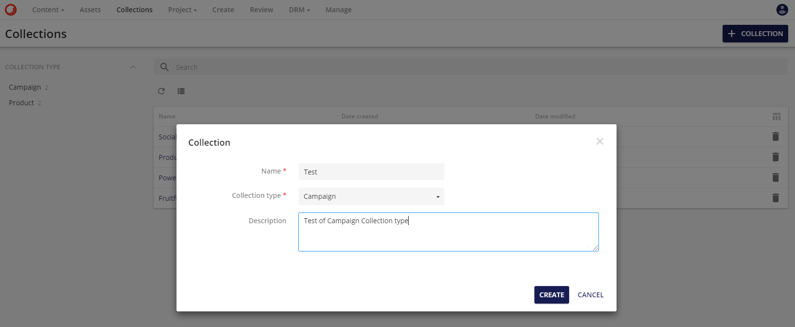
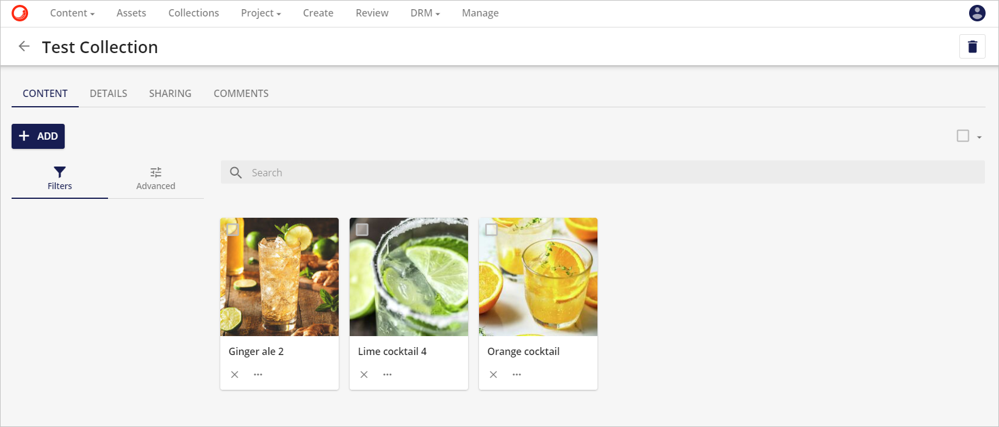
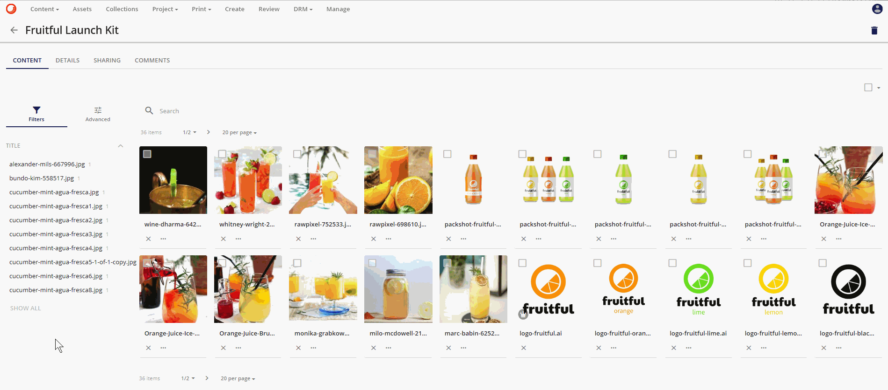
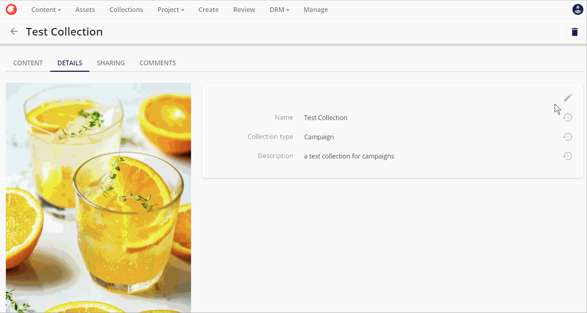

# コレクション

**コレクション**のページには、ユーザーが作成した、またはユーザーと共有しているコレクションのリストが表示されます。各コレクションには**タイプ**と**説明**があり、このコレクションがどのような目的で使用されるかを指定します。コレクションは、フルテキスト検索またはファセット検索のいずれかで検索することができます。コレクションは、テーブルビューまたはグリッドビューのいずれかで表示することができます。

コレクションの概要ページを参照してください。

**コレクションオーバービューページ**

**コレクション**は、右上の **+COLLECTION** ボタンを使用して作成することができます。このボタンをクリックすると、コレクションの詳細を入力するモーダルが開きます。

* **名前** はフリーテキストフィールドです。
* **コレクションタイプ** は、ドロップダウンオプションでアウトオブボックスのオプションを提供しています。
    * キャンペーン
    * 製品
    * イベント
* **説明** は複数行のフリーテキストフィールドです。

必要な詳細を入力したら、**CREATE** をクリックします。

新しいコレクションがコレクションページに表示されます。

## コンテンツ

コレクションにアセットを追加するには、**コンテンツ** ページで新しいコレクションを開き、**追加** を選択します。**リンクアイテム** オプションまたは**クリップボードから貼り付け**選択した Sitecore DAM 内のアセットと新しいコレクションの間にシンボリックリンクを作成します。

**コンテンツ**ページでは、選択した画像や貼り付けた画像を表示します。

コレクション内のアセットの 1 つを**マスターとして設定**するには、アセットのアクションアイコン  を使用します。アセットを**マスター**に設定すると、アセットのサムネイル プレビューにクラウン アイコンが表示されます。

コレクションの削除にはダストビンアイコン  のダストビンアイコンを使います。

### フィルター

**フィルタ**オプションは、表示するように選択された任意のファセットを利用します。ファセットは、定義されたメタデータフィールドの繰り返し検索の速度を上げるために使用することができます。

この例では、アセットのタイトルがコレクションの**検索コンポーネント**に含まれていることが選択されています。

このファセットは、その後、コレクションの内容のフィルタを作成するために使用することができます。

### 高度な機能

Advanced オプションは、 ユーザーが複雑なクエリを構築することを可能にします。クエリは、コレクションに含まれるアセットのメタデータの条件を使用して構築されます。

* メタデータフィールドが選択されている。

  

* リレーションを選択します。

  

* 条件を決めています。

  

このクエリは、コレクションのコンテンツをフィルタリングするために使用されます。

## 詳細

詳細タブには、特定のコレクションとそのメタデータに関する情報が含まれています。

詳細を編集するには、鉛筆のアイコンをクリックします。

## 共有

このタブでは、ユーザーがコレクションを公開して共有することができます。コレクションは他のユーザーやユーザーグループと共有することができます。

内部ユーザーまたはユーザーグループを追加するには、**編集**ボタンをクリックし、**追加ユーザー**ボタンに進みます。**ユーザー**または**ユーザーグループ**のオプションで選択リストが表示され、必要な値が選択されたら**保存**をクリックします。

デフォルトでは、これらのユーザーまたはユーザーグループは、コレクションのリーダーとして追加されます。これらのユーザーまたはユーザーグループは、コレクションの**コントリビューター**または**マネージャー**の役割に昇格することもできます。

必要な値を選択したら、**保存** をクリックします。

エンティティの可視性は、通常のユーザーグループポリシーに従って処理されます。任意のロールにユーザーを追加しても、既存のセキュリティ ルールは上書きされません。その影響は、Collectionエンティティのみに限定されます。

### 外部ダウンロードページ

この機能により、ユーザーはコレクションを外部ダウンロードページとして公開することができます。これにより、コレクションの制限のないアセットを外部のウェブサイトで利用できるようになります。外部ダウンロードページには以下のオプションがあります。

* **利用可能なダウンロードオプション:**

  ユーザーは、外部ダウンロードページでダウンロード可能なレンディションを選択できます。デフォルトでは、オリジナルとプレビューのオプションが選択されている。

* **URL パス:**

  システムは自動的にURLパスを生成します。ユーザーは自分で定義したパスを設定することも、新しいパスを生成することもできます。

* **ページの有効期限:**

  ユーザーは有効期限を設定することができます。デフォルト値はなしで、手動で無効化されるまでページはオンラインのままです。利用可能なオプションは、7日、30日、または固定の有効期限です。

設定を保存すると、バックエンドジョブがページの作成を開始します。ページがすぐに利用できるわけではないことに注意してください。設定は、**設定** ボタンをクリックして後で修正することができます。

設定を保存すると、バックエンドジョブがページの作成を開始します。ページがすぐに利用できるわけではないので注意してください。設定は、**設定** ボタンをクリックして後で修正することができます。

その他のオプションは、外部ダウンロードページのURLの横にあります。

* **リンクをコピー:**

  このオプションは、リンクをクリップボードにコピーします。

*ユーザーを追加* ボタンは、内部共有にのみ適用されます。外部ダウンロードページでは、認証を必要とするかどうかを設定できます。

* **認証が必要:**
 
  この場合、外部ページにアクセスする前に、全員がSitecore Content Hub内で認証を行う必要があります。
  
  ページにアクセスしようとすると、ユーザーは自動的にSitecore Content Hubのログインページにリダイレクトされます。

* **認証は必要ありません**

  この場合、コレクションは公開されています。誰でも外部ダウンロードページにアクセスして、利用可能なレンディションをダウンロードすることができます。

### コメント

コメントはコメントタブを使ってコレクションに追加することができます。**新しいコメント**をクリックして、新しいモーダルでコメントを追加し、**投稿**をクリックします。

