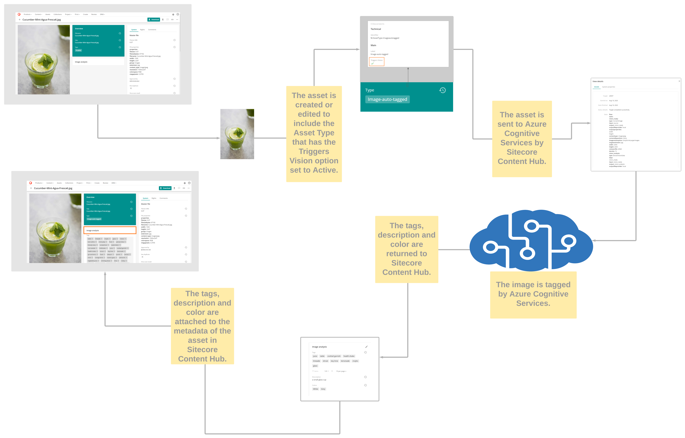
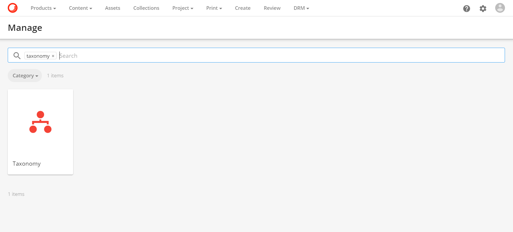
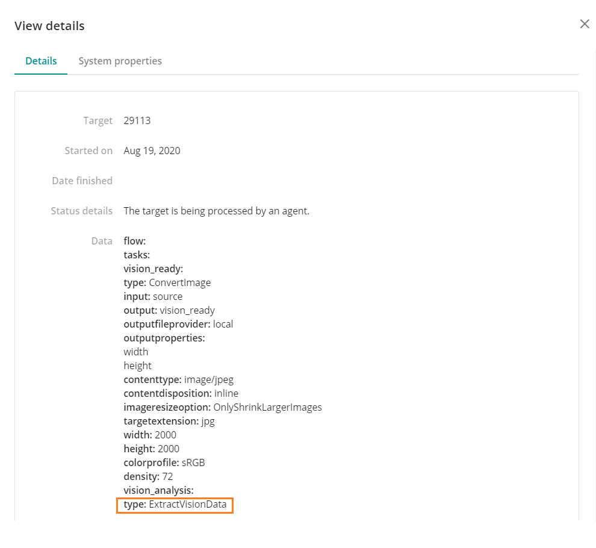
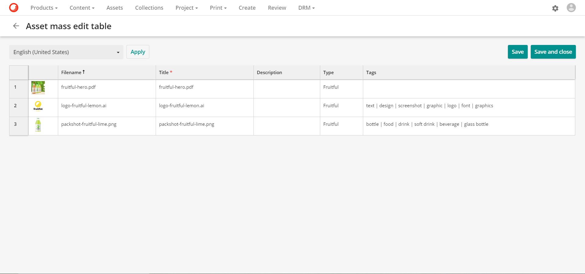
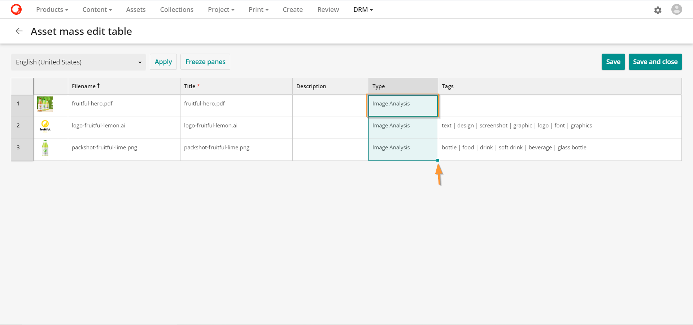
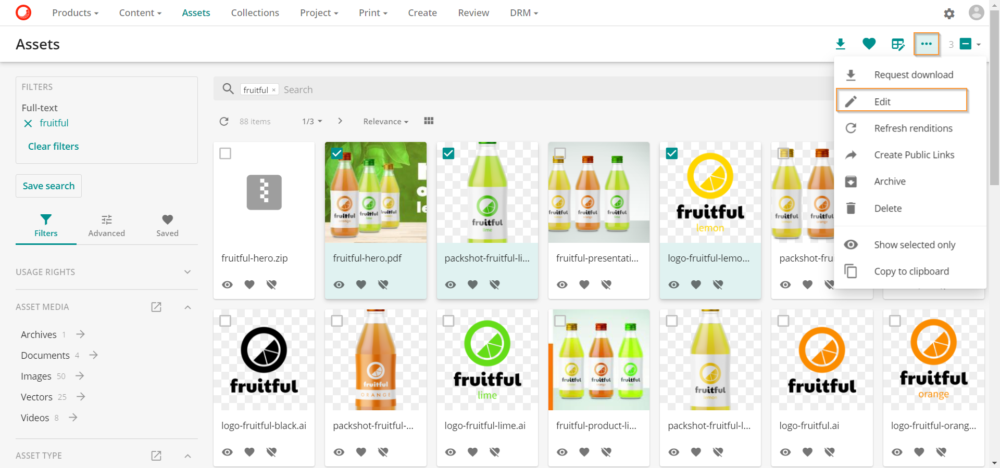
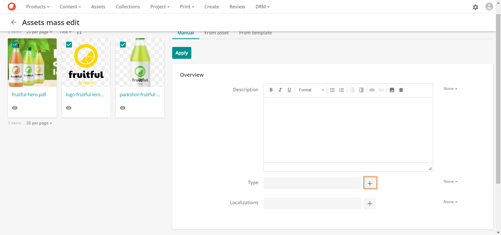

# 画像分析

画像解析機能は、人物、動物、オブジェクト、風景、アクションなどの画像の内容に関連するタグを生成します。

この機能は、画像認識ツールであるAzure Cognitive Servicesに依存しています。Sitecore DAM はこれを統合して、アセットの自動タグ、説明、色認識データ（画像とベクトルのみ）を生成します。

以下のワークフローは、Sitecore DAM での画像解析の流れを表しています。

**アセット詳細**ページの画像解析の項目を見ることができます。

Vision [メディア処理フロー](../../administration/processing/media-processing/processing-flow-detail.md)は、画像解析機能を処理します。フローは、**管理** > **メディア処理**にあります。

画像解析機能は以下のファイルタイプをサポートしています。

* 画像: bmp, bpg, cr, cr2, crw, dib, dng, dpx, erf, gif, jfif, jp2, jpe, jpeg, jpg, jxr, nef, orf, raf, raw, srw, tga, webp
* ベクター: ai、eps、png、psb、psd、svg、tif、tiff

> [!Note]
> 画像解析機能では、動画アセットには独自の流れがあるため、処理はしません。[ビデオAI解析](video-ai-analysis.md)を行います。

## 画像解析の設定

画像解析を設定するには

1. [M.AssetType タクソノミーを設定する](#set-up-the-massettype-taxonomy)
2. [Vision サービスを有効にする](#enable-the-vision-service)

> [!Warning]
> スーパーユーザのみが、このセクションで説明されている設定手順を実行できます。

### <a name="set-up-the-massettype-taxonomy" />M.AssetType タクソノミーを設定する

画像解析機能は、特定のアセット タイプを持つアセットにのみ適用されます。*M.AssetType* [タクソノミー](../../administration/data/taxonomies/taxonomy.md) を設定することで、画像解析機能を起動するアセット タイプを選択できます。既存のアセット タイプを選択するか、新しいアセット タイプを作成できます。

新しいアセット タイプを M.AssetType タクソノミーに追加するには、次の手順に従います。

1. **管理** > **タクソノミー** に移動します。

  

2. M.AssetTypeタクソノミーを検索して選択します。

  

3. をクリックすると、M.AssetTypeタクソノミーの新しい項目が追加されます。

  

4. **ラベル**を入力します。この例では、**ラベル**は *Image Analysis* です。**識別子**は自動生成されます。

  

5. **保存** をクリックします。

### <a name="enable-the-vision-service" />Vision サービスを有効にする

画像解析のトリガーとなるアセットタイプを特定したら、関連するタクソノミー項目でVisionサービスを有効にする必要があります。

M.AssetType タクソノミー項目で Vision サービスを有効にするには、次の手順に従います。

1. **管理** > **タクソノミー**に移動します。

2. *M.AssetType* タクソノミーを検索して選択します。

3. 構成する必要のあるタクソノミー項目を見つけ、 をクリックして編集します。

  

4. **Triggers vision**を*True*に設定します。

  

  > [!Tip]
  > 画像の類似性機能を使用する場合は、同じページの「コグニティブ」の下にある「トリガー画像の類似性」フィールドを有効にしてください。

5. **保存**をクリックします。

## 画像分析の適用
アセットに画像解析を適用するには、トリガービジョンを有効にしたアセットタイプをアセットに割り当てる必要があります。

これを使用するようにアセットを設定するには、いくつかの方法があります。

* [1 つのアセットに画像解析を適用する](#apply-image-analysis-to-a-single-asset)
* [表の編集を使用して複数のアセットに画像解析を適用する](#apply-image-analysis-using-edit-in-table)
* [一括編集を使用して複数のアセットに画像解析を適用](#apply-image-analysis-using-mass-edit)

### <a name="apply-image-analysis-to-a-single-asset" />1つのアセットに画像解析を適用

1. **アセットの詳細**ページに移動して、アセットの詳細ページで編集アイコン  をクリックします。

  

2. タイプフィールドで、編集タイプボタン をクリックします。

  

3. **トリガービジョン**を有効にしたアセットタイプを選択し、**OK**をクリックします。

  

4. 概要に戻り、**保存**をクリックします。

  

5. 保存後、あなたのアセットはAzure Cognitive Servicesによって分析されます。これは、[バックグラウンドプロセス](../../administration/system/stats/job-types.md)ページにあるジョブの詳細で確認できます。

  

6. 結果は、**アセット詳細**ページの画像解析セクションで確認できます。

### <a name="apply-image-analysis-using-edit-in-table" />テーブル内の編集を使用して画像解析を適用する

1. **アセット**ページでアセットを選択し、 アイコンをクリックします。[編集可能なテーブル](../edit/edit-in-table.md)が表示されます。

  

2. 最初のアセットの Type セルをダブルクリックし、Triggers ビジョンを有効にしたアセットタイプを選択し、OK をクリックします。

  

3. 緑のボックスをドラッグして、残りのアセットのTypeセルを埋めます。

  

4. **保存**をクリックして閉じます。

5. 保存後、アセットはAzure Cognitive Servicesによって分析されます。結果は、**アセットの詳細**ページの画像解析セクションで確認できます。

### <a name="apply-image-analysis-using-mass-edit" />マス編集を使用して画像解析を適用する

1. **アセット** ページでアセットを選択し、  をクリックし、**編集**を選択してアセットを[一括編集](../edit/edit-content.md#mass-edit)します。

  

2. アセット一括編集画面で、 をクリックして、Typeフィールドを更新します。

  

3. **トリガーズビジョン**を有効にしたアセットタイプを選択し、**OK**をクリックします。

  

4. 新しいアセット タイプは、既存の値を置き換えるようにデフォルトで設定されています。**適用**をクリックして変更を保存します。

  

5. 変更内容を確認するには、**確認**をクリックします。

  

6. 保存後、アセットはAzure Cognitive Servicesによって分析されます。結果は、**アセット詳細**ページの画像解析セクションで確認できます。

