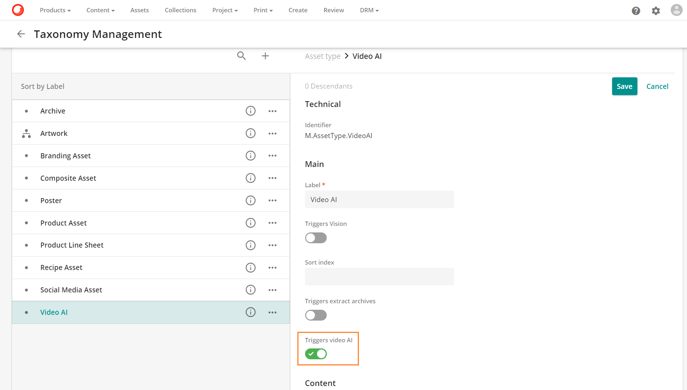
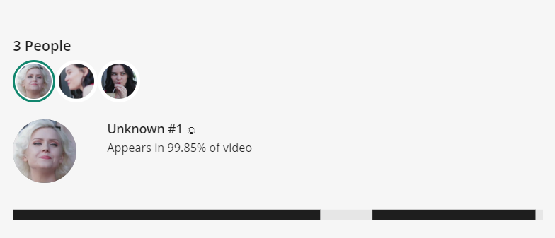
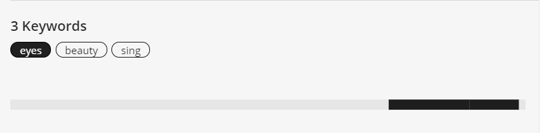
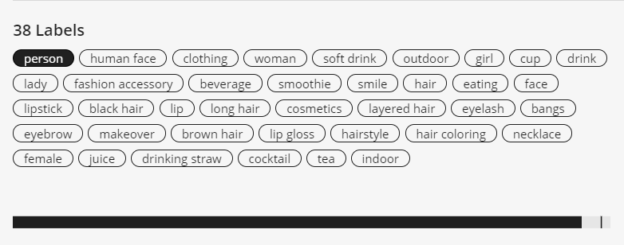
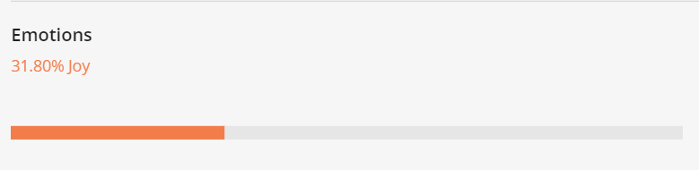
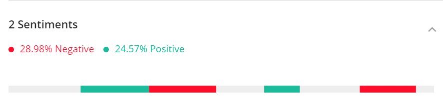
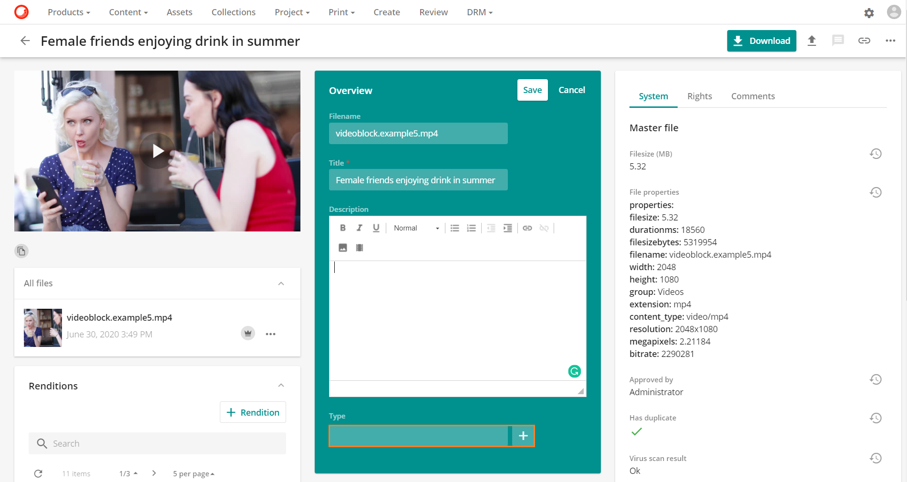
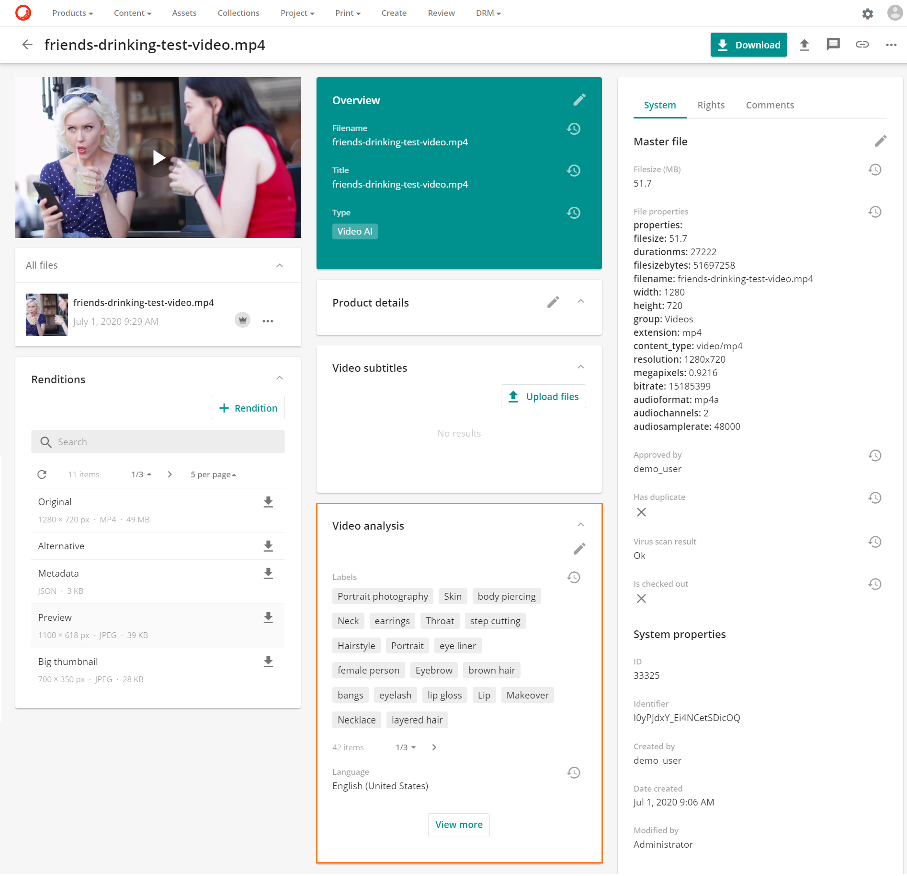

# ビデオ AI 分析

**Sitecore Content Hub**は、**Microsoft Azure**メディアサービスの**Video Indexer**と統合されました。この統合により、企業は動画アセットから価値ある洞察を得ることができます。**Video Indexer**は、動画から顔、有名人、感情、トピック、ブランド、シーンなどのメタデータを自動的に抽出します。抽出されたメタデータは、*Sitecore Content Hub*内からアクセスできるため、アセットの発見性を高め、収益化の機会を増やすことができます。

ビデオAIは以下の機能を提供します。

* **顔認識と有名人の識別**
* **視覚的なテキスト認識と物体の識別**
* **シーンのセグメンテーションとキーフレームの抽出**
* **キーワードの抽出とトピックの特定**
* **言語の識別**
* **自動テープ起こし**

> [!Video https://mss-p-003-delivery.stylelabs.cloud/api/public/content/840ad65fb6e64d8e9988777e08f3a989?v=b54c875f]

**アセット**タイプを拡張して、TriggersVideoAIという名前の新しいプロパティを含むようにビデオAI定義を含めることで統合が実現しました。この**ビデオAIの トリガー**プロパティは、タクソノミー管理ページの下にあるアセットタイプで有効にするためにアクティブにトグルされています。Triggers ビデオAI 

このプロパティを有効にすることで、**Triggers ビデオAI**のプロパティを含む**アセット**タイプが**TRUE**に設定されている場合、メディア処理ジョブが起動します。

> [!Note]
> ビデオ解析機能を提供しているのは、ビデオAIのアセットタイプのみです。

## ビデオ解析機能

**アセットの詳細**ページには、**人**、**トピック**、**ラベル**などの解析結果のメタデータを表示するための**動画解析**パネルがあります。**条件付き詳細ページ**の機能を介して、すべての動画アセットは、**動画解析**パネルを含む関連する動画機能を持つ専用の動画ページに誘導されます。

動画が処理されると、**動画解析**パネルが返されたメタデータラベルで埋められ、View more ボタン  ボタンが表示されます。

**View more **オプションを選択すると、ユーザーは、**Video indexer 詳細ページ**に表示されている完全な詳細解析に誘導されます。

以下の要素を表示します。

## ビデオインデクサーの詳細ページ

**Video indexer の詳細**ページでは、分析は **Insights** の下のセクションに分解され、専用のビデオプレーヤーも表示されます。

* **プレーヤー** **Video indexerの詳細**ページには、ボリュームコントロールとフルスクリーン機能を備えた専用のプレーヤーがあります。

  

### インサイト

* **人物** 動画内で特定された人物のインサイトタブがあり、動画内での人物の出現場所や、動画内での人物の出現率などのタイムラインが表示されます。

  * **顔検出** 顔を検出してグループ化します。
  * **アニメーションキャラクターの検出** アニメーションキャラクターの検出、グループ化、識別を行います。
  * **有名人の識別** 有名人を検出して識別します。有名人を検出し、簡単な経歴とともに識別します。
  * **ベストサムネイル抽出** 検出した顔のサムネイルに最適な画像を自動的に抽出します。

  
  
* **キーワード**を検索します。各セグメントで言及されているキーワードを検索します。

  

* **トピック** 主なトピックを特定します。

  

* **ラベル** オブジェクト（例：猫、テーブル、車、ボールなど）を自動的に識別し、表示された時刻をタイムラインで表示してラベルを付けます。

  

* **言語** 動画内で識別される言語。

  

* **感情** 音声、音声信号、顔の表情で表現される感情を検出します。

  

* **感覚** 音声や動画全体のポジティブな感情とネガティブな感情のレベルを比較し、クリック可能なタイムラインで感情が表現されている場所を表示します。

  

* **シーン**（プレビュー）。動画をセマンティックシーンごとにセグメント化します。

  

* **キーフレーム** 安定したキーフレームを自動的に検出します。

  

### タイムライン

**タイムライン** タブでは、音声分析を使用して動画をグループ化します。

* **自動テープ起こし**: ビデオに含まれる音声を英語のテキストに変換します。この変換がタイムラインに表示され、スピーカーの識別、話者と対応する話し言葉のマッピングが表示されます。

## アセットに動画解析を追加する

動画解析は、アセットのライフサイクルのどの段階でもアセットに追加することができます。

* 作成
* レビュー
* 承認済み

アセットの詳細ページで、編集アイコンの編集アイコン をクリックします。

アセットのメタデータが編集可能な場合は、[タイプ] フィールドで [+] オプションを選択すると、アセット タイプの選択肢が表示されます。

表示されたアセット**タイプ**からビデオAIを選択します。

動画アセットはAzure Video Indexerに送られ、そこで動画が分析されます。

解析が完了すると、タグは Sitecore Content Hub に返され、アセットに関連付けられます。

