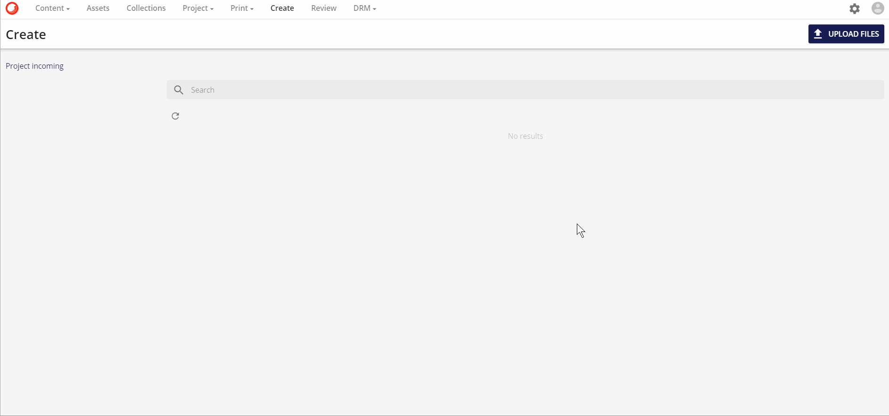
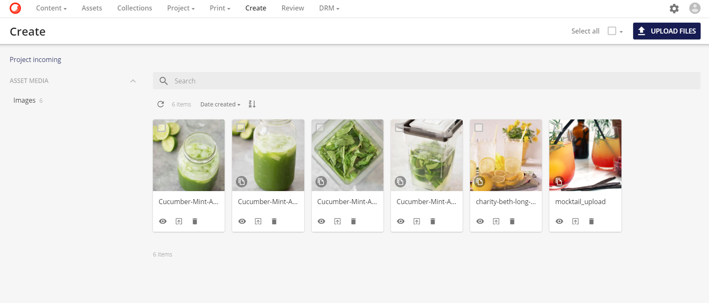
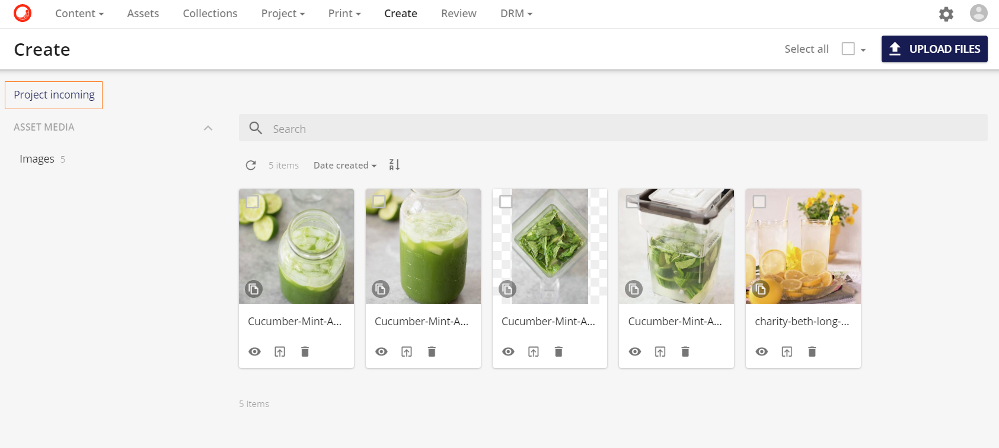
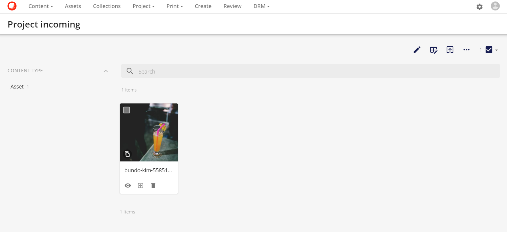

# アップロードとコンテンツ作成

**作成ページ**では、ユーザーが新しいファイルをシステムにアップロードすることができます。また、レビューのためにまだ提出されていないファイルの概要も表示されます。

ユーザーは3つの方法で新しいファイルを作成することができます。

* **ドラッグ＆ドロップ**

  ユーザーは、**アップロード**タブの下にあるドラッグ＆ドロップ機能を使ってファイルを作成することができます（HTML5に準拠したブラウザでサポートされています）。

  

* **ファイルを選択**

  ユーザーは、**ファイルの選択**機能を使用してファイルを作成することができ、アップロードしたいファイルを選択することができます。

  ファイルがアップロードされている間、ユーザーはページを離れることはできません。プログレスバーは、アップロードの進捗状況を示すために表示されます。

  

* **ファイルのインポート**

  ユーザーは、アップロードしたいファイルのURL（公開または署名済み）を紹介できる **インポートリンク** 機能を使ってファイルを作成することができます。

  **インポート** をクリックすると、アセットをアップロードするためのジョブが作成されます。アップロードの状況は、**マイジョブ** ページで確認することができます。アップロードが完了すると、作成ページにアップロードされたアセットが表示されます。

  

> [!Note]
> * ファイルは設定されたホットフォルダを介してアップロードすることもできますが、これは実装固有のものです。
> * ユーザーは、アップロード操作を任意に一時停止/再開することができます。
> * アップロードサイズの制限は、1ファイルあたり8GBに設定されています。

## 作成ページ

**作成ページ**には、アップロードされたファイルと、現在のユーザーが作成したすべてのドラフトアセットが表示されます。また、Createページには、Project incomingページへのリンクボタンがあります。DAMに送られてきたプロジェクトブロックからの成果物は、このページで管理することができます。

### サムネイル

山のアイコン  は、これらのジョブの優先順位が設定されていることと、レンディションの作成に必要な処理時間のために、メディアエンジンによってアセットのレンディションがまだ作成されていないことを示しています。レンディションは最終的にグリッドに表示されます。

サムネイルやプレビューのレンディションが作成できない場合（サポートされていないファイルタイプなど）、定義済みの画像を使用することができます。デフォルトの定義済み画像は以下のとおりです。

*  オーディオファイル（.mp3、.wavなど）。

*  圧縮データファイル(.zip、.7zなど)の場合。

*  プレビューを作成できないファイルの場合。

動画のアップロードには、アニメーションのサムネイルがあります。これらのアニメーションは、アップロードされた動画の数フレームで構成されています。このアニメーションは、マウスのカーソルがサムネイルの上に置かれると始まります。サムネイルの上にマウスカーソルを置き、同時にクリックすることで、異なるフレームを参照することができます。

### コンポジットアセット

圧縮ファイル（複合アセット）の場合、**Sitecore Content Hub**は、ルートフォルダ内の最初に利用可能な画像ファイルを使用し、アセットファイルの履歴にある他のすべてのファイルに設定するように設定することができます。この機能により、圧縮ファイルからプレビューやサムネイルのレンディションを作成することができないため、代替ファイルでサムネイルやプレビューを自動的に設定することができます。

複合アセット機能では、圧縮ファイルの内容をアセットの詳細ページで確認することができます。詳細ページの詳細については、[詳細ページ](../../content-user-manual/edit/detail-page.md)のセクションを参照してください。

この機能のために設定された設定は、**設定**ページで確認できます。次のスクリーンショットは、設定例を示しています。

**解釈** .ZIP ファイルがアップロードされると、ファイルのルートにあるサブファイルをチェックします。このファイルのリストから、最初の許容可能な .jpg または .pdf ファイルが自動的に代替ファイルとして設定されます。

## プロジェクトの着信

ページの左上にプロジェクト着信ページのタブがあります。

コンテンツに送信（アセットのみ）** ボタンは、選択したアセットをプロジェクト着信の ** 作成ページ に送信します。

すると、アセットは**プロジェクト着信ページ**に移動します。

ここから、アセットはレビューのために送信され、最終アセットとしてDAMに提出されます。

> [!Note] 
> 作成ページでは、アセットは **作成** 状態（新規ファイルのアップロードや下書きの作成の場合）または「却下」状態（レビューページでアセットが却下された場合）にすることができます。これは、検索オプションのStatusを使用してフィルタリングすることができます。
> 
