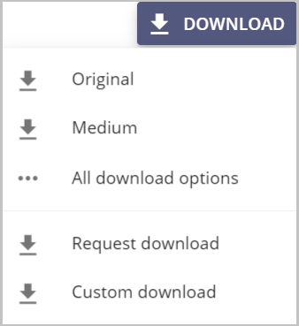
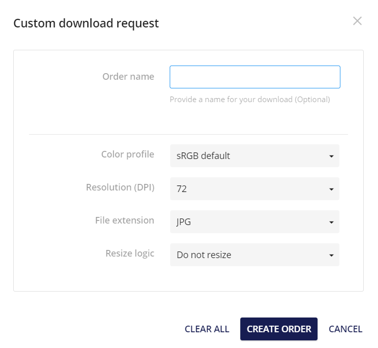
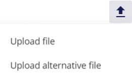
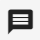
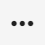
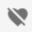
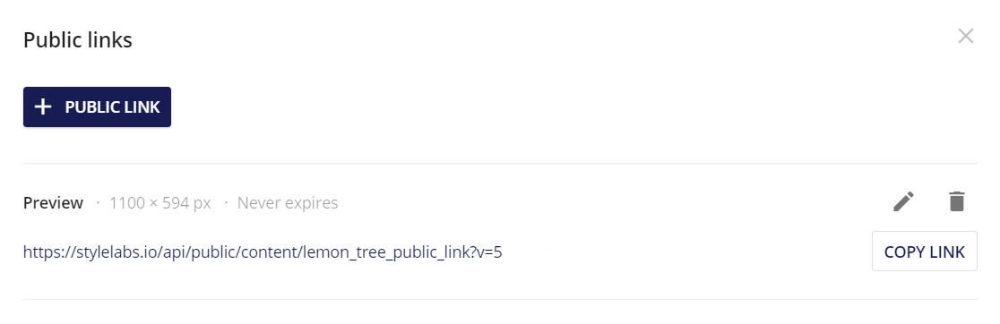
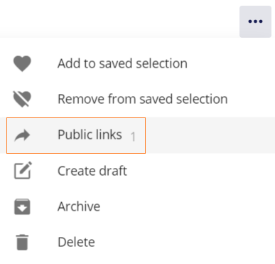
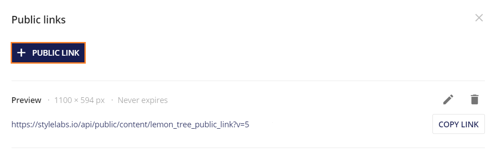

# アセット操作

アセットの詳細ページでは、右側のツールバーにいくつかのオプションが表示されています。

* **ダウンロード**: ユーザーにさまざまなダウンロードオプションを提供します。

  

  * **オリジナルダウンロード** アセットのオリジナル版をダウンロードします。
  * **ミディアムダウンロード** アセットのプレビュー版をダウンロードします。
  * **すべてのダウンロード** オプションでは、利用可能なレンディションをダウンロードするオプションを提供します。

    

  * **リクエストダウンロード** ユーザーが許可を得ていないデジタル著作権のコンテキストで使用するために、アセットをダウンロードする権利を要求することができます。

    

  * **カスタムダウンロード** カラープロファイル、解像度（DPI）、ファイル拡張子、リサイズロジックなど、ユーザーによってカスタマイズされたバージョンのアセットをダウンロードします。

    

*  アップロードでは、**ファイルのアップロード**と**代替ファイルのアップロード**の2つのオプションが表示されます。**ファイルをアップロード**するとマスターバージョンとして新しいバージョンのファイルがアップロードされ、**代替ファイルをアップロード**するとマスターバージョンを上書きして新しいバージョンのファイルがアップロードされます。

  

*  **アノテート**では、アセットに注釈を追加することができます。詳細は[アノテート](../review/annotations/overview.md) を参照してください。

*  **ダイレクトリンク**を使用すると、アセットのプレビューへのリンクが作成され、他のユーザーと共有することができます。

## その他のアクション

その他のアクション  より多くのオプションを表示すると、アセットの操作が可能になります。

*  **保存された選択範囲にアセットを追加する** :  保存された選択範囲に追加すると、保存された選択範囲にアセットを追加することができます。詳細については、[保存された選択範囲](../search/search-menu.md#saved-selections)を参照してください。

*   **保存された選択範囲**から削除すると、保存された選択範囲からアセットを削除することができます。

*  **下書きを作成**すると、アセットを下書き形式で開きます。

*  **アーカイブ**は、アセットをアーカイブ状態に移動します。この移動により、一般的な検索ページからアセットが削除されます。アーカイブされたアセットは、インライン プレビューまたはアセットの詳細ページで [復元] ボタンをクリックすると、検索ページに復元できます。

*  **パブリックリンク**では、アセットを外部で共有するためのパブリックリンクを作成することができます。

  

  そして、パブリックリンクが生成されます。

  

  パブリックリンクが既に存在する場合は、アイコンに表示されます。

  

  アイコンをクリックすると、パブリックリンクが表示されます。このパブリックリンクが要件を満たしていない場合、新しい2つ目のパブリックリンクを作成するには、以下をクリックしてください：新しいパブリックリンクを作成するアイコン
  
  

*  CMPモジュールで作成されたコンテンツでアセットが使用されている場所が表示されます。この例では、CMPで作成された電子メールコンテンツでアセットが使用されています。

  

