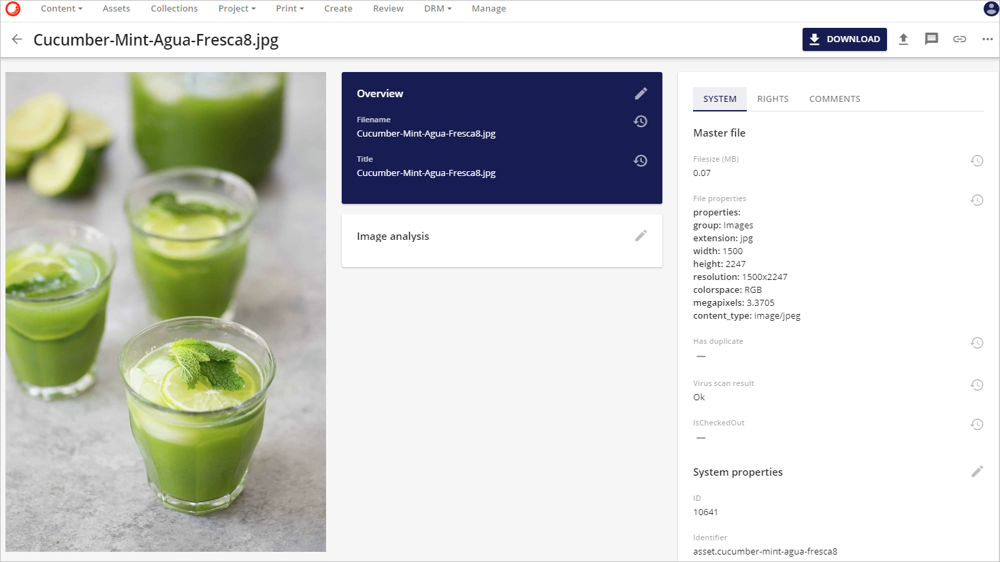
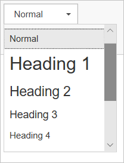
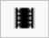
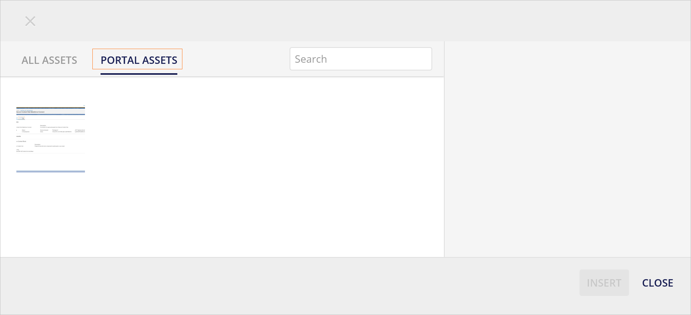
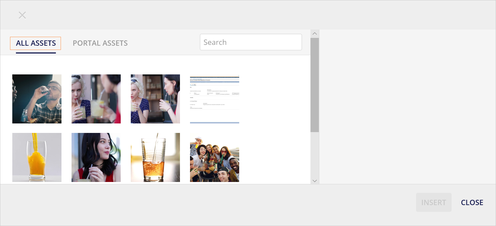
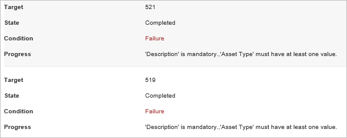
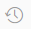
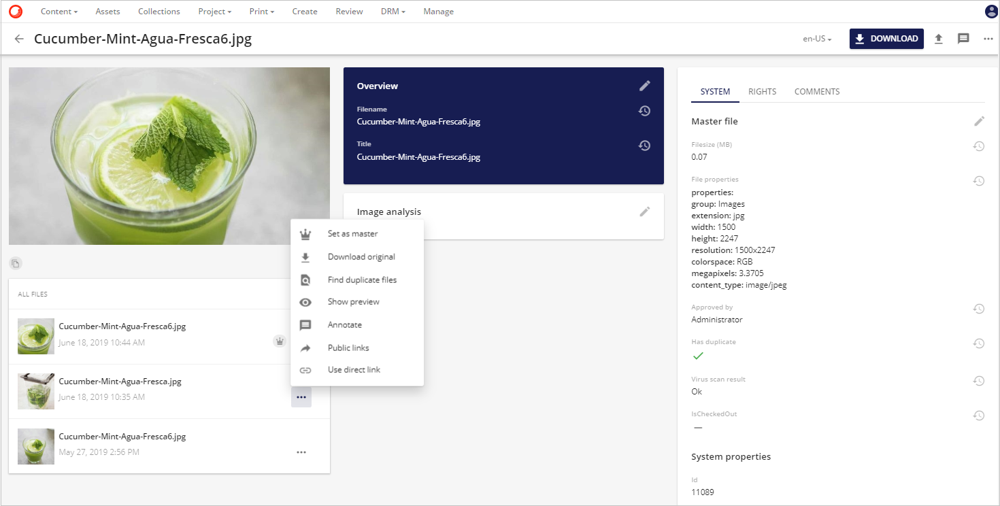
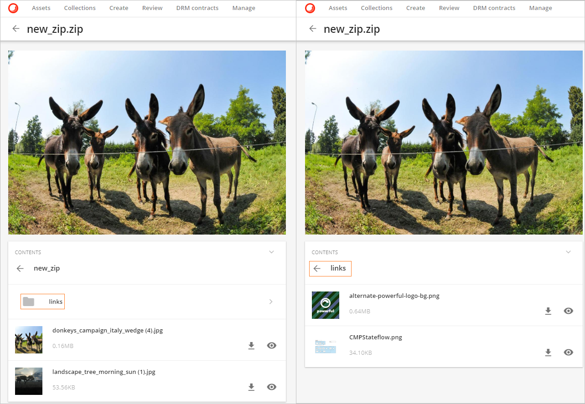
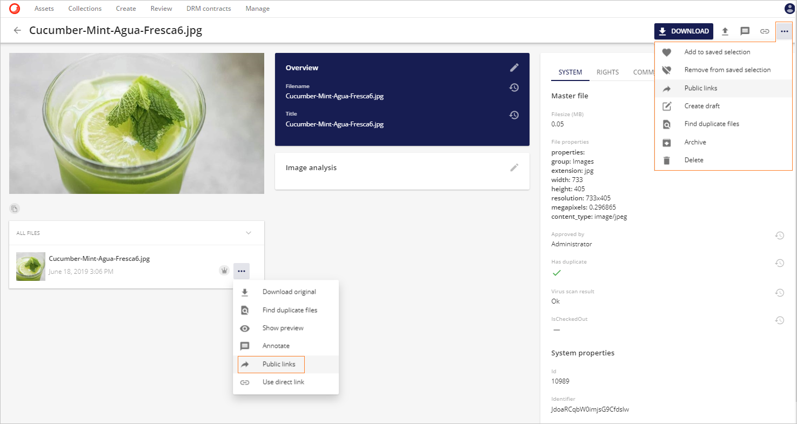

# 詳細ページ

**アセット詳細**ページなどの詳細ページを使用します。

* 表示/編集アセットの一般的なプロパティを多言語にすることができます。
* ファイル履歴の表示
* アセット/ファイルを使ったアクションの実行(個別ダウンロード、注釈、下書きの作成、異なるレンディションの公開リンクの作成など)

## アセットの詳細ページ

アセットの詳細ページに表示される実際のプロパティ、リレーション、および定義は、実装固有のものであり、設定可能です。

以下のデータ型がサポートされています。

* 文字列値（単一値または複数値のいずれか）
* 数値値
* 日付/時刻値
* ブール値
* ファイル参照
* 1対1、1対多、多対多の関係。

## アセット詳細の概要

アセット概要では、アセットとそのメタデータを簡単に見ることができます。

このメタデータは、鉛筆のアイコン  をクリックして編集または追加することができます。 クリックして拡大表示すると、メタデータが編集可能な形式で開き、利用可能なすべてのプロパティが表示されます。必要に応じて変更を加え、**保存** をクリックします。

以下のような変更が可能です。

* **ファイル名** はフリーテキストフィールドです。アセットがアップロードされたときに含まれていた元のファイル名が表示されます。

  

* **説明** は名目上はフリーテキストフィールドですが、**CKEditor**の基本ツールバーの機能の省略された選択が含まれています。CKEditorは、メディア挿入と共同編集機能を備えたスマートなWYSIWYGリッチテキストエディタです。

  

* ツールバーには、**太字**、**斜体**、**下線**の標準テキストフォーマットが含まれています。

  

* **段落形式**のテキスト編集オプションがあります。

  

* **箇条書き付きリストの挿入/削除**、または**番号付きリストの挿入/削除**のいずれかを使用してテキストをフォーマットするオプションがあります。

  

  箇条書きリストのプロパティを変更するには

  * 箇条書きリストを入力します。
  * 入力された箇条書きリストを選択します。
  * 右クリックして、**箇条書きリスト**のプロパティを選択します。
  * 必要なタイプが選択されたら、OKをクリックします。
  
    

* **インデントを減らす**ボタン、**インデントを増やす**ボタンでインデントを減らしたり、増やしたりすることができます。

  

* CKEditor の**リンク機能**は、クリック可能なハイパーリンクや電子メールアドレスをリッチテキスト文書に追加することができる強力なオプションです。リンクは  クリックして拡大表示アイコンで挿入することができます。このアクションは新しいモーダルを開き、挿入されたリンクをさらにフォーマットしたり、より多くのオプションを選択したりすることができます。

  

  ユーザーがリンクをテキストの断片に割り当てたい場合は、まずそれを選択する必要があります。テキストが選択されていない場合は、リンク URL または電子メール アドレスがそのままドキュメントに表示されます。

  **リンク** ダイアログ ウィンドウが開き、ユーザーはリンクの種類と設定オプションを選択することができます。リンクの種類に応じて、リンク オプションをグループ化した 2 つまたは 4 つのタブがあります。

    * リンク情報
    * ターゲット(このタブはURLリンクタイプのみ利用可能)
    * 高度な設定

* これは、作成されたかもしれないが、もはや必要のない**リンクを削除**するためのリンク解除オプションも存在しなければならないことを示しています。 クリックすると拡大表示されます。

* 画像は、**画像の挿入** ボタン  を介して挿入することができます クリックして拡大表示する。

  どちらかのポータルアセットを選択するユーザーの選択肢があります。
  
  

  またはすべてのアセットが利用可能です。

  
  

    * ユーザーは、**画像の挿入**ボタンをクリックして必要なアセットを選択します。
    * 次に、**ポータルアセット** セクションまたは **すべてのアセット** セクションで画像を選択します。
    * サムネイル・プレビューをクリックして画像アセットを選択します。
    * ユーザーは、画像の配置と画像のサイズを定義することができます。
    * 必要に応じて Alt テキストを指定することもできます。

  

* 同様に動画は、**ビデオの挿入**ボタンを使用して挿入することができます。

  **ポータルアセット**としてアップロードされた動画を追加するには、どちらかのオプションがあります。

  

  または利用可能なビデオアセット。

  

**地理 > リレーションエディタ**

以下のスクリーンショットは、リレーションやタクソノミを編集する際の可能性の例を示しています。

地理関係にはドリルダウンの可能性があります。ヨーロッパは、イタリア、スペイン、ベネルクス（さらに掘り下げることができます）、フランス、ポルトガルまでドリルダウンできます。

**地理＞関係編集＞一段階掘り下げる**

典型的には、選択を容易にするために検索ボックスが提供されます。下のスクリーンショットでは、キュウリで検索が開始されています。関連性がある場合は、左側にファセット検索を設定することもできますが、この例では、含まれるファセットは Asset Type です。

**関連アセット＞リレーションエディタ**

> [!Note]
> 変更を適用／保存する際には、編集したメタデータ・プロパティに対してデータ検証が行われます。

> [!Note]
> 複数の言語でサポートされているメタデータ・プロパティがある場合、ユーザーはプロパティ値を定義する前にカルチャを選択する必要があります。

## 必須フィールド

アセットプロパティとリレーション（ファセット）には、必須フィールドを定義することができます。これらの必須フィールドは、プロジェクトに定義されたワークフローに応じて設定することができます。

例えば、マイ アップロード（ステータス = 作成）に存在するアセット（ステータス = 作成）の場合、ユーザーが承認のためにこのアセットを提出する前に、少なくともアセット プロパティ「説明」と「ドキュメント タイプ」の値が必要となります。アスタリスクは、条件付きフィールドと完全必須フィールドを示しています。

**必須フィールド UI**

レビューに提出する際にこれらの必須プロパティが入力されていない場合、エラーメッセージが表示されます。このエラーメッセージは、個々のアセットを提出する場合はページに直接表示され、大量に編集して提出する場合はジョブの詳細に表示されます。

**必須フィールドのエラーメッセージ**

**必須フィールドを大量に送信すると、エラーメッセージが表示されます**

## メタデータ履歴

アセットの詳細ページでは、ユーザーは各プロパティまたは関連フィールドの横にある履歴アイコン を見つけることができます。このアイコンをクリックすると、フィールド固有のモデルウィンドウのポップアップが表示され、選択したアセットで行われたすべての変更が表示されます。各変更には、タイムスタンプとユーザー名が付いています。

**メタデータ履歴UI**

## メタデータの履歴を有効にする

ユーザーがメタデータ履歴にアクセスできるようにするには、以下の2つの権限が割り当てられている必要があります。

* **ViewDataHistory**: アセット・エンティティの各フィールド・プロパティに加えられた変更を表示することができます。

* **ReadAudit**：ユーザー管理ページのビジネス・ログとユーザー監査ログを読み取ってダウンロードする権限を提供します。

これらの権限は、スーパー・ユーザーによって、ユーザーを追加することによって、ユーザーに付与することができます。これらの権限を持つ既存のユーザー・グループに追加したり、ユーザー・グループを修正したり、新しいユーザー・グループを作成して、新しいユーザー・グループにこれらの権限を割り当てることができます。

* **ViewDataHistory**権限は、**M.Asset**のような任意の定義または**個々の定義**のために、新しいユーザーのグループに新しいルールとして割り当てられます。

  

* **ReadAudit**権限を特権として付与しました。

  

ルールと [グループ ユーザー ポリシー](../../administration/security/users/policies/user-group-policies.md)の詳細については、ユーザー グループ ポリシーを参照してください。

特権の詳細については、 [特権](../..//administration/security/users/policies/privileges.md)を参照してください。

## エンティティ履歴ビューア

ファイル履歴パネルは、アセットEntityに複数のファイルバージョンが含まれている場合に表示されます。

**エンティティの履歴ビューア**

ファイル履歴に複数のファイルがある場合、マスターファイルではないファイルに対していくつかの操作を行うことができます。

* **マスターとして設定**：マスターファイルを置き換えます。
* **オリジナルをダウンロード**: オリジナルのファイルをダウンロードすることができます。
* **重複ファイルの検索**：システム内に重複ファイルが存在することを確認することができます。重複ファイルの場所は、「重複ファイルの表示」ボタンをクリックすることで取得できます。
* **プレビューを表示**: ファイルのプレビューを表示するポップアップウィンドウを開きます。
* **アノテート**  アノテーションページに移動します。
* **パブリックリンク**: パブリックリンクを追加できるポップアップウィンドウが開きます。
* **ダイレクトリンクを使用**: ダイレクトハイパーリンクを作成します (このリンクがアセットの閲覧権限のない人に送信された場合、エラーメッセージが返されることに注意してください)。{"メッセージ". "このリクエストに対する認証が拒否されました。)

## 複合アセット

環境内で複合アセットとして設定されている圧縮ファイル（.zipファイルなど）の場合、圧縮ファイルの内容をアセット詳細ページに表示することができます。

**複合アセットの構造**

圧縮ファイルのルートに存在する各ファイルについて、ユーザーはプレビュー  、直接ダウンロード  することができます。

圧縮ファイルのサブフォルダに存在するファイルの内容を表示することができます。

**複合アセット > サブフォルダに移動**

## 公開リンク

パブリックリンクツールを使えば、ユーザーはワークスペース全体へのアクセスを提供する必要がなくなります。これにより、アセットのレンディション用のリンクを生成し、Sitecore Content Hubの登録ユーザーではない人と共有することができます。パブリックリンクは、アセットレベルとファイルレベルの両方で生成することができます。この方法では、アセットのパブリックリンクは常にマスターファイルの選択されたレンディションを指しますが、ファイルのパブリックリンクは静的なもので、ファイル履歴全体の中の特定のファイルを指します。

**パブリックリンクオプション**

**パブリックリンク**については、 [パブリックリンク](../../content-user-manual/share/public-links.md?q=transformation) をご覧ください。

## メディアプロセッシング

再生ボタンのオーバーレイは、オーディオとビデオのアップロードに表示されます。

**動画アセット > 再生ボタンオーバーレイ**

再生ボタンオーバーレイをクリックすると、オーディオまたはビデオプレーヤー用のモジュールが開きます。シークバーのサムネイルは、ビデオプレーヤーで利用できます。シークバーの上にマウスカーソルを移動すると、サムネイルが表示されます。サムネイルには、ビデオ内の特定の位置を表すフレームが表示されます。

**ビデオ > 代替としてフレームをキャプチャ**

ビデオプレーヤーのモジュールには、「Capture Frame As Alternative」ボタンも含まれています。このボタンをクリックすると、現在のフレームをキャプチャし、ビデオの代替ファイルとして設定し、ビデオを表現していたサムネイルが置き換えられます。

## エンティティの評価
管理者が有効にした場合、このコンポーネントはエンティティの評価を可能にします。エンティティが評価を受けた場合、平均的な評価が表示されます。この評価はすべてのユーザーに表示されます。個人的な評価を与えることができ、一度与えられた評価は表示されますが、これはいつでも変更することができます。

### システム

アセットの詳細ページに表示されているのは、**システム**メニューの下にあるアセットのシステムプロパティとメタデータです。

以下の項目がシステムタブに含まれています。

* ファイルサイズ (MB)
* ファイルのプロパティ
    * グループ(画像、ビデオ、アーカイブなど）
    * 拡張子(jpg、pngなど)
    * 幅 (ピクセル単位)
    * 高さ (ピクセル単位)
    * 解像度
    * 色空間
    * メガピクセル
    * コンテンツタイプ(image/jpeg など)
    * 承認者
    * Has duplicate（アセットに重複がある場合）
    * ウイルススキャンの結果
    * IsCheckedOut（ユーザーがOneDriveでチェックアウトしたか、アセットの下書きを作成したことを意味します）
* システムのプロパティ
    * Id (システムが生成した ID)
    * 識別子 (システムが生成した一意の識別子)
    * 作成者
    * 作成日
    * 更新日
    * 変更された日付
    * 更新回数（アセットがアクションされた回数を追跡する：アップロード、編集、更新など）

## 著作権

**著作権**メニューには、アセットのデジタル権利管理情報が表示されます。

ユーザーが必要な権限を持っていれば、このメタデータを編集することができます。

DRMの詳細については、[デジタル著作権管理](../../content-user-manual/secure/digital-rights-management/concepts.md)を参照してください。

## コメント

**コメント**は、コメントメニューを使ってアセットに追加することができます。

新しいコメントを追加するには、新しいコメントボタン  を使用します。

コメントに返信するには、返信ボタン  を使用します。

