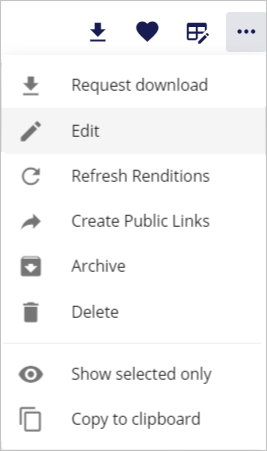
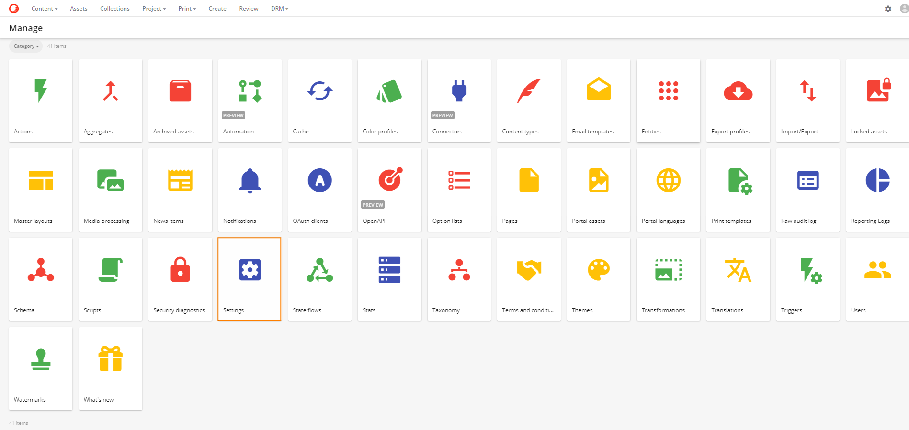
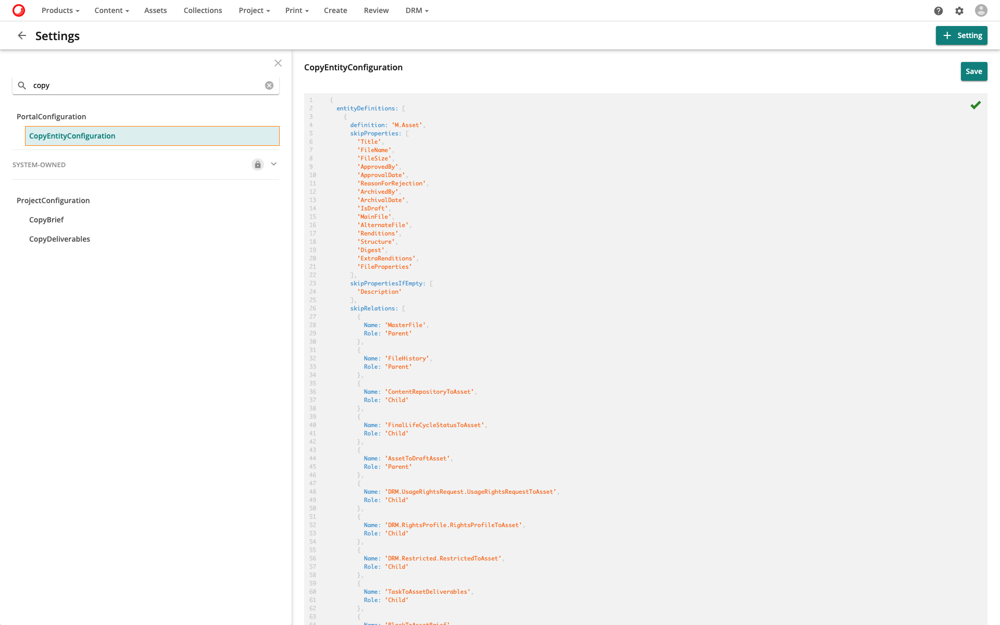
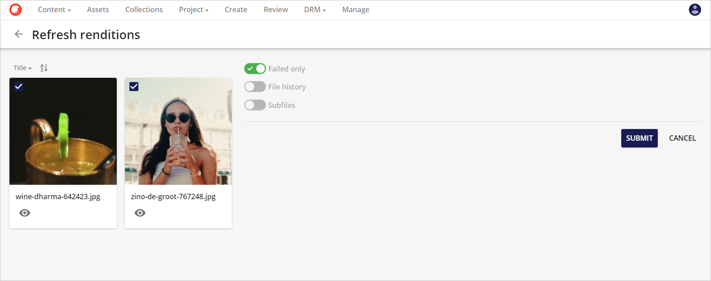

# コンテンツ編集

ここでは、Content Hubでコンテンツを編集する方法を説明します。

## クイック編集
デフォルトでは、アセットの名前またはサムネイルをクリックすると、アセットの詳細ページにリダイレクトされます。ただし、アセットに表示されているプレビュー操作の目のアイコン をクリックすると、インライン プレビューが表示されます。

インラインプレビューでは、ダウンロード、保存された選択範囲への追加、保存された選択範囲からの削除、アーカイブなど、事前に定義されたプロパティと操作がプレビューとして表示されます。

インラインプレビューの右上にある編集ボタンをクリックすると、利用可能なフィールドを編集することができます。

フィールドを編集した後、ユーザーは**保存**ボタンまたは**保存して次へ**ボタンをクリックして変更内容を保存することができます。**保存して次へ**ボタンをクリックすると、現在の変更が保存され、リストの次のアセットが編集されます。

> [!Note]
> インライン プレビュー フィールドは、検索コンポーネントで設定することができ、詳細コンポーネントを使用して自動的に設定することもできます。これについての詳細は、自動化されたインライン プレビュー フィールドを参照してください。

## 選択バスケット

Sitecore Content Hubで複数のアセットを選択すると、それらは選択バスケットに集められます。選択ドロップダウンメニューから、ユーザーは選択したアセットに対して大量のアクションを実行することができます（例：一括編集の実行やダウンロード注文の作成）。

**選択バスケットは、ページ、コレクション、またはブロックに固有のものです**。例えば、ユーザーは**作成**ページでエンティティを選択し、**コンテンツ**ページでは異なる選択をすることができます。ユーザーが手動で変更しない限り、すべての選択バスケットの有効期限は24時間です。

## 一括編集

**一括編集**機能により、ユーザーは選択した複数のアセットの共通プロパティを編集することができます。

共通プロパティのそれぞれについて、ユーザーは以下のアクションのいずれかを選択することができます。

* **なし**: プロパティに変更はありません。
* **置換**: 置換：現在の値を新しい値に置き換えます。
* **クリア**: プロパティの実際の値をクリアします。
* **追加**: 追加します。追加のタクソノミー項目を関連項目のリストに追加します。
* **削除**: 既存のプロパティを削除します。既存のプロパティを削除します。

ユーザーは、選択ドロップダウンメニューの**編集**ボタンをクリックすることで、これを実現できます。これは、以下の3つの便利な方法で選択されたアセットの共通のプロパティを編集することができる一括編集ページにそれらをリダイレクトします。

* [マニュアル](#manual)
* [アセットから](#from-asset)
* [テンプレートから](#from-template)

変更を送信した後、作成されたジョブは**マイジョブ**ページでモニターすることができます。

一括編集ジョブの詳細については、以下の項目を参照してください。

### <a name="manual" />マニュアル

ユーザーは、**アセット一括編集**ページの最初のタブからメタデータ・フィールドの詳細を手動で編集することができます。詳細を入力した後、ユーザーは**適用**ボタンをクリックして変更を適用することができます。

### <a name="from-asset" />アセットから

また、**アセットから**タブを使用して、既存のアセットに基づいて一括編集を実行することも可能です。ユーザーは、選択したアセットのメタデータ・プロパティのうち、どのプロパティを置き換えたいかを選択できます。変更を行うソースとしてアセットを選択すると、そのアセットのプロパティのセットが選択したアセットにコピーされます。

スーパーユーザーは、[設定](../../administration/system/settings/settings.md) の `MassEditSearchConfiguration` を更新して、**アセットから** タブのリレーションエディタの検索設定を設定することができます。

> [!Note]
> 編集に事前に設定されたソースを使用する場合、ユーザーは、ソース上のメタデータ・フィールドが選択されたアセット上のものと一致していることを確認する必要があります。

### <a name="from-template" />テンプレートから

また、**テンプレートから**タブを使用して、テンプレートに基づいて一括編集を行うことも可能です。ユーザーは、選択したアセットのメタデータ・プロパティのうち、置換したいものを選択することができます。事前に設定されたテンプレートが変更を行うソースとして選択されると、そのテンプレートからのプロパティのセットが選択されたアセットにコピーされます。

また、スーパーユーザーは、`SettingsのMassEditAssetTemplateSearchConfiguration`を更新して、Fromテンプレートタブのリレーションエディタの検索[設定](../../administration/system/settings/settings.md)を行うことができます。

Sitecore Content Hub でのテンプレートの管理については、[こちらのセクション](../customize/user-pages-menu.md#templates)を参照してください。

> [!Note]
> 事前に構成されたソースを編集に使用する場合、ユーザーは、ソース上のメタデータ・フィールドが選択されたアセット上のものと一致していることを確認する必要があります。スーパーユーザーは、設定の`CopyEntityConfiguration`を変更して、特定のメタデータ・メンバーを自動的にスキップすることもできます。スキップするように設定されていても、編集中に手動で詳細を更新した場合、これらのメンバーは更新されます。

> [!WARNING]
> ソースまたは一括編集ページに1-1-1 (oneToOne)リレーションが含まれている場合、1-1-1リレーションは複数のアセットに適用できないため、最初のアセットを除くすべてのアセットに対して一括編集ジョブは失敗します。

### プロパティをスキップする (一括編集テンプレート)

ユーザーは、`CopyEntityConfiguration` 設定を更新することで、一括編集テンプレートで定義されたプロパティをスキップすることができます。ユーザーはまず、**管理**の**設定**に移動する必要があります。

左のスライダーで`CopyEntityConfiguration`の設定を検索し、クリックします。

**JSON エディタ**で必要な変更を行い、**保存**ボタンをクリックして変更を適用します。

## レンディションの更新

一括更新レンディション機能では、選択したアセットのレンディションを一度に更新することができます。ユーザーは、選択ドロップダウンメニューの**レンディションの更新**ボタンをクリックすることで、選択したアセットのレンディションを一括更新することができ、**レンディションの更新**ページにリダイレクトされます。

選択された項目について、ユーザーは以下のオプションの1つまたは複数を選択することができます。

* **失敗したもののみ** 失敗したレンディションのみを更新します。
* **ファイル履歴** ファイル履歴のレンディションを更新します。
* **サブファイル** サブファイルの表示を更新します。

## パブリックリンクの作成

アセットは、有効期限付きで公開されているリンクを介して共有することができます（オプション）。URLは、公開リンクダイアログ画面から取得することができます。ユーザーは、選択したアセットのドロップダウンメニューの**公開リンクの作成**ボタンをクリックすることで、選択したアセットに対して複数の**公開リンクを作成**することができます。

公開リンクと公開リンクとして選択されたレンディションに有効期限を設定することができます。

* プレビュー
* サムネイル
* オリジナル
* MP4
