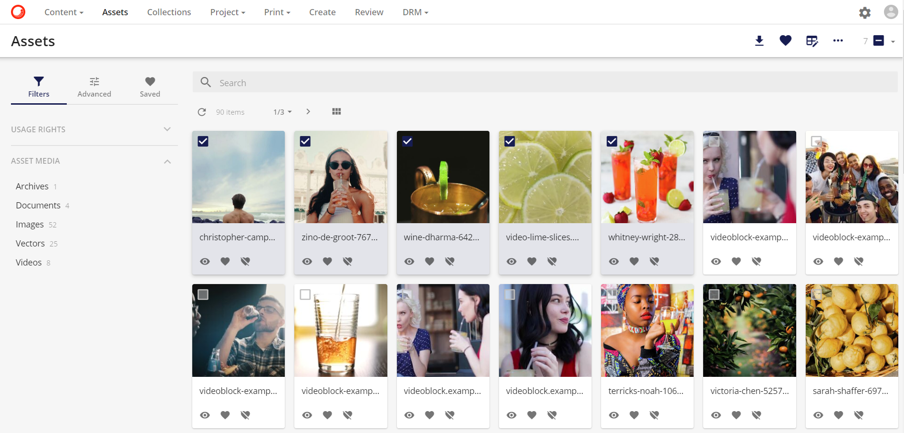
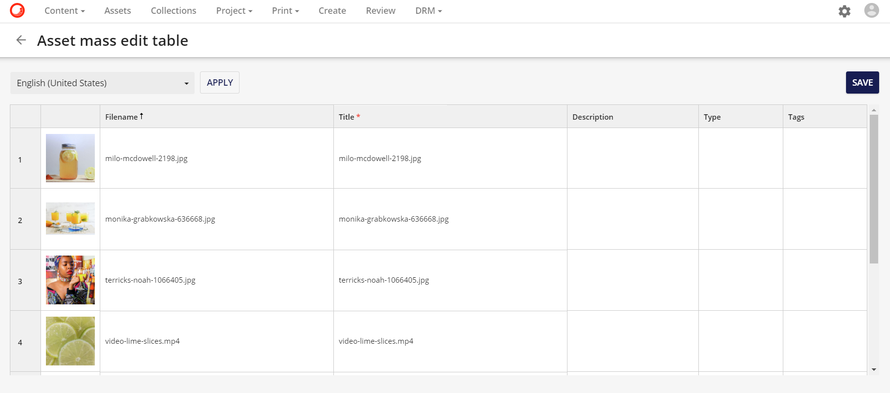
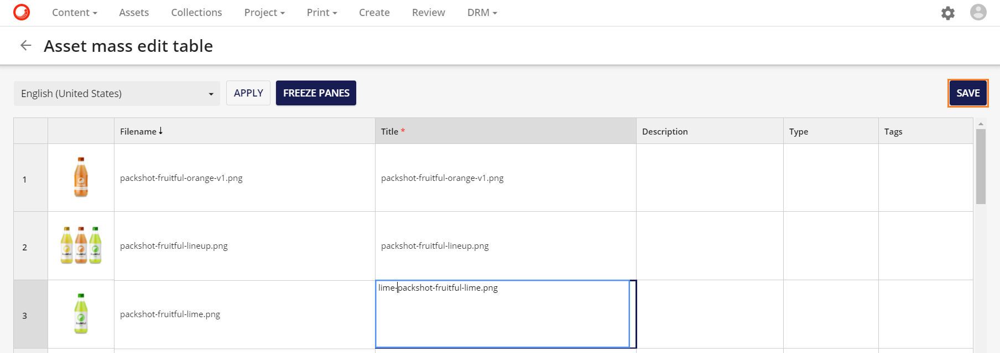
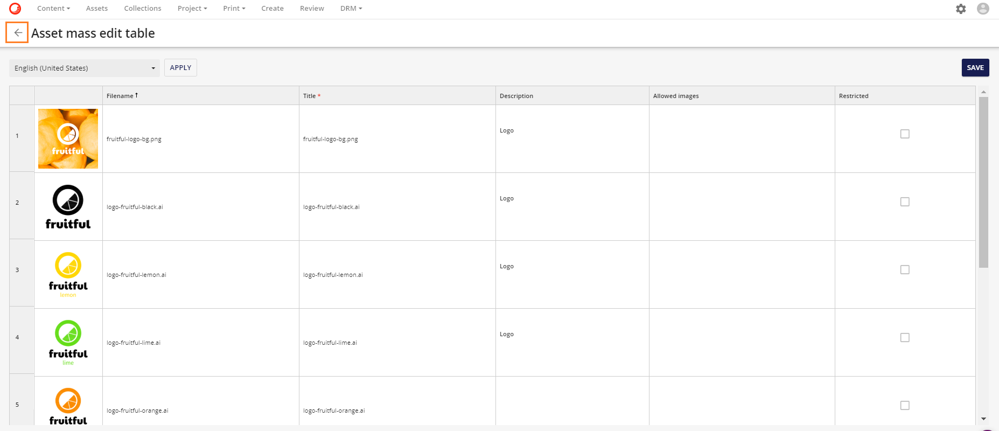
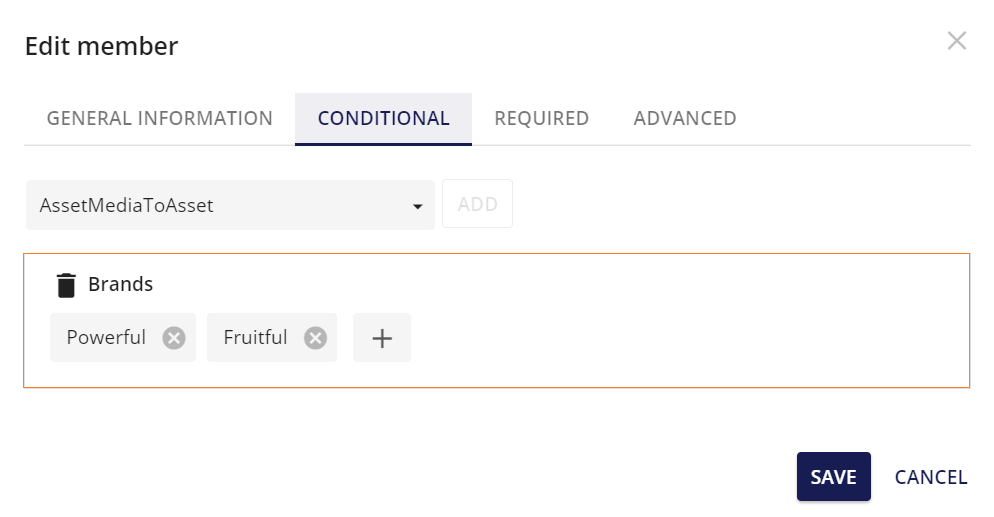
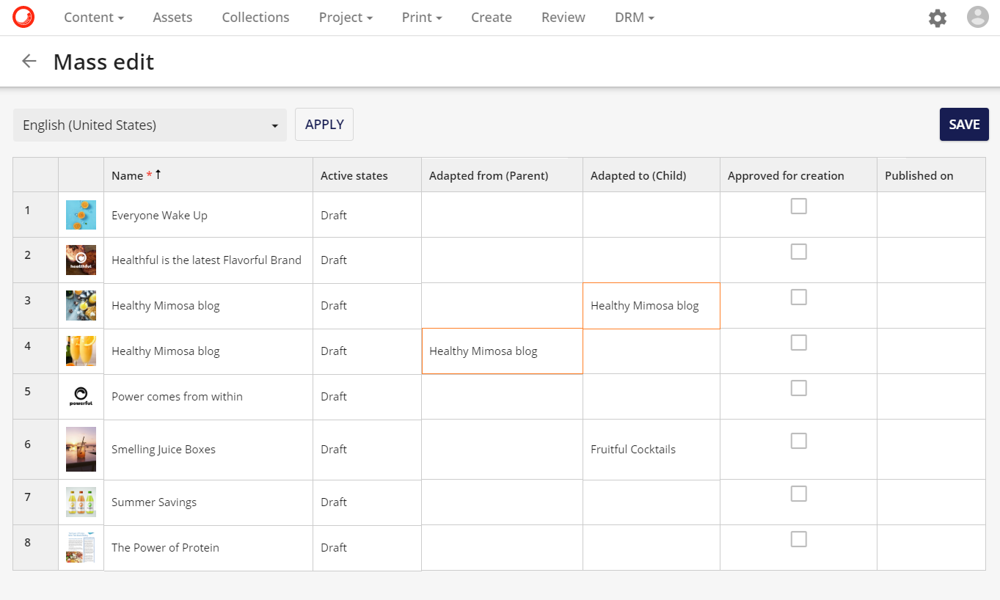
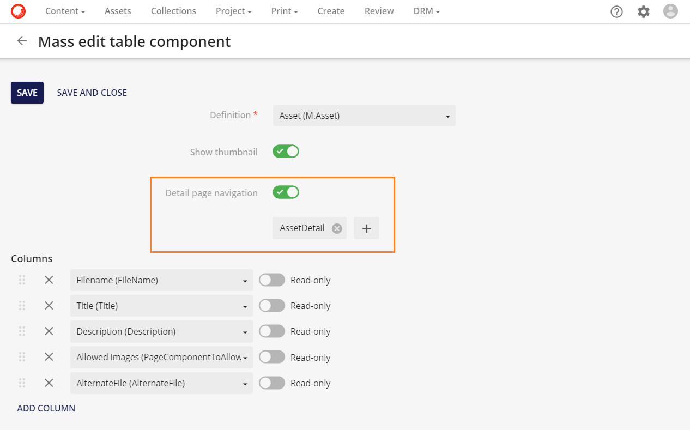

# テーブルで編集

**テーブルで編集**機能では、選択したアセットのメタデータを大量に更新することができます。メタデータはテーブル形式で表示され、大量更新が可能になります。

* **コンテンツ** ページで、更新するアセットを選択します。

  

* ツールバーの右側にある「表の編集」アイコンをクリックします。

  

* 選択したアセットのメタデータが表形式で表示された新しいウィンドウが開きます。

   
  
* メタデータは、選択したフィールドをクリックすることで、個別に変更および/または追加することができます（ボックスの境界線の色が紺色に変わり、アクティブであることを示します）。

  

* 新しいメタデータを追加できるようになりました（メタデータが追加されるとボックスの枠が水色に変わります）：新しいメタデータを追加できるようになりました。

  

* 変更が完了したら、保存をクリックして変更内容を保存します。

  

* 複数の項目のフィールドに同じメタデータを入れる場合は、ドラッグ＆コピー機能を利用します。1つのフィールドにメタデータを追加し、クリックするとボックスの境界線がオレンジ色に戻ります。境界線の右下には四角があり、これを下にドラッグするだけで、必要なアセットのメタデータフィールドにこの値を入力することができます。

  

## 保存ボタン

これにより、ユーザーは特定の 一括編集 テーブルを離れることなく、一括編集 テーブルに含まれるメタデータの編集を継続しながら、メタデータの更新を段階的に保存できるようになりました。

以下の例では

* ユーザーは、**ロゴ**の検索から返されたアセットを選択します。
* 選択されたアセットのメタデータが一括編集テーブルで開かれます。
* ユーザーは、一括編集テーブルの最初の2行の説明に**ロゴ**を追加し、これらの変更を保存します。
* その後、ユーザーはマス編集テーブルに残って、さらに変更を加えることができます。

一括編集テーブルから離れるには、戻る矢印ボタン を使うか、メニューを使ってください。

ユーザーが変更を保存せずにページから出ようとした場合、警告が表示されます。

そのため、ユーザーが作業を保存するのを忘れてしまっても、変更が失われることはありません。

## DateTimeとDateTimeOffsetフィールド

一括編集テーブルで、**DateTime**と**DateTimeOffset**の書式設定と編集が改善されました。シングルクリックはフィールドを**String**として編集し、ダブルクリックは**DateTimeセレクタ**を開きます。

次の例では、ユーザーは DateTimeOffset の値をクリックします。

* ユーザーは、1 行目で承認されたデータの値を 1 回クリックし、日付を 11 月から 10 月に変更する String として編集します。
* 2 行目では、ユーザーは Data approved フィールドをダブルクリックし、DateTime セレクタを使用して日付を編集することができます。

## 条件付き＆必須フィールド

条件付きフィールドおよび必須フィールドについて、**一括編集テーブル**の機能が改善されました。強化されたデータ検証に基づく新しいインジケータが 一括編集テーブルに追加され、必須値が省略されている場合や条件付き値にエラーが含まれている場合にユーザーに警告を表示するようになりました。

> [!Note]
> エラーを含むテーブルセルを表示するビューエラー機能が新たに追加され、データの検証が改善されました。

次の例では

* ユーザーは、一括編集テーブルの最初の行の**Title**の値を削除します。**タイトル**は、ヘッダー セルの赤いアスタリスクによって必須として表示されます。

 

* **保存**をクリックした後、インポートが完了すると、エラーが表示されます。
* エラーを見ると、**タイトル**が必須プロパティであることが関係しています。

条件付きで**Brands**が設定されていて、**M.Asset**と条件付きの関係を持っている場合

と表示されている場合、**Brands**は一括編集テーブルでは必須と表示されます。

## 自己参照フィールド

この改良により、親と子の両方の関係を持つ自己関連エンティティを同じマス編集テーブルに表示できるようになりました。これにより、ユーザーは、任意のマス編集が親と子の関係にまたがって一貫していることを確認することができます。

次の例では、**Adapted from (Parent)**と**Adapted to (Child)**がContent 一括編集テーブルに表示されています。

## HTMLフィールド

一括編集テーブルのHTMLフィールドのレンダリングが改善されました。HTMLは生のHTMLではなく、実際のHTMLとしてレンダリングされます。レンダリングされたHTMLフィールドを編集すると、リッチテキストエディタが開きます。

HTMLフィールドは**CKEditor**の**リンク**機能を使っています。これはクリック可能なハイパーリンクや電子メールアドレスをリッチテキスト文書に追加することができる強力なオプションで、リンクの見た目や動作をコントロールすることができます。

## サムネイルプレビュー
一括編集テーブルに含まれるサムネイルをクリックしてプレビューできるようになりました。サムネイルをクリックすると、新しいモーダルでプレビュー画面が開きます。

## 詳細ページへ移動

**一括編集テーブル**を設定する際に、トグルでアクティブにできる**詳細ページナビゲーション**のオプションがあります。**詳細ページナビゲーション**には、**詳細ページ**を追加する必要があります。以下の例では、M.Assetの定義にリンクされた**一括編集テーブル**に含まれる**詳細ページナビゲーション**オプションに**AssetDetail**ページが追加されています。

**詳細ページナビゲーション**は、一括編集テーブルに含まれています。ユーザーは、テーブルの各行に表示されている詳細ページをクリック することができます。

この例では、アイコンをクリックすると、その行に含まれるアセットの詳細ページに移動します。

## ブール値プロパティフィールド
一括編集テーブルのブール値プロパティの機能が改善されました。この機能改善により、ブール値がチェックボックスとして表示されるようになり、**NULL**プロパティは**FALSE**として表示されるようになりました。ドラッグ アンド ドロップ機能は、Mass-edit テーブル全体で引き続き機能します。

次の例では、**M.Asset**の新しいメンバである**Restricted**という名前のメンバが作成されています。

ブール値は、以前は**True**または**False**の文字列として入力されていました。値が一括編集テーブルの**Restricted**カラムで編集された場合、以前は変更は**True**または**False**のどちらかの文字列として入力されていました。

しかし、値をティックボックスとして提示できるようになり、ドラッグ＆ドロップはまだ残っています。

## フリーズペイン

フリーズペイン機能は、表計算アプリケーションでよく見られる機能です。一括編集テーブルでは、行や列を「フリーズ」します。そのため、表のどの部分が表示されているかにかかわらず、その行または列は常に所定の位置に表示されます。ユーザーがテーブルを縦または横にスクロールすると、凍結された行または列以外はすべてスクロールします。ペインの凍結は、テーブルのヘッダー行が常に表示されるようになっている場合に特に便利です。

