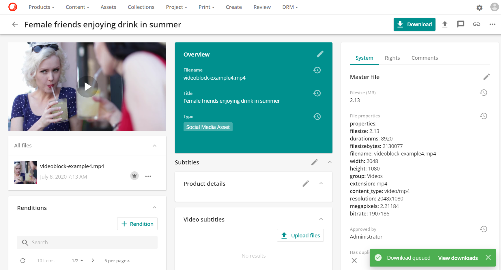

# ビデオのトリミング

動画全体ではなく、動画の一部または部分のみが必要な場合、Sitecore Content HubTM内で動画のその部分をトリミングして抽出することができます。このトリムされた部分は、動画の新しいレンディションとしてダウンロードしたり、保存したりすることができます。このトリミングにより、ユーザーはすべての作成プロセスを経ることなく、新しい動画アセットを作成することができ、既存のすべての動画アセットに付加価値を与えることができます。

次の動画では、動画のトリム機能を紹介します。

> [!Video https://mss-p-003-delivery.stylelabs.cloud/api/public/content/e9084cdda124400f8ecb12a385f98502?v=45e0730c]

## 動画アセットをトリミングする

動画アセットの**アセット詳細**ページで、**ダウンロード**をクリックし、**カスタムダウンロード**を選択します。

**カスタムダウンロード**ページで、動画の下の左に表示されている**トリムボタン**をクリックします。

ビデオは、正確な**トリミング**を可能にするためにフレームに分割されたトリムページに表示されます。分割されたフレームは、動画の下にあります。

ビデオをフレームに分割することで、ユーザーは黄色のタブを使用して、トリミングされたビデオの必要な開始と終了を正確かつ簡単に選択することができるようになりました。黄色のタブは、トリムされたビデオの開始と終了として機能する正確なセクションにドラッグする必要があります。

> [!Video https://mss-p-003-delivery.stylelabs.cloud/api/public/content/1e2fdb807100442880dbd22d3fe8777a?v=e8a8f9da]

必要なトリムを行ったら、**完了**をクリックします。

**完了**をクリックすると、動画プレビューの下部にあるプレイバーの黄色のタブで表示されているトリミングされた部分が表示されたカスタムダウンロードページに戻ります。

**カスタムダウンロード**には、以下のオプションがあります。

* **フォーマット**：フォーマットを選択することができます。

  

* **ファイル名**: ダウンロードのためにファイル名を指定することができます。アセットのプロパティは、中括弧の間にプロパティ名を入力することで使用できます（例：{Title}）。

  

  カスタム ダウンロード ページが閉じ、ユーザーはダウンロード メッセージ ボックスを含む動画アセット詳細ページに戻ります。

  

  **ダウンロードを表示**オプションをクリックします。

  

  カスタム ダウンロードは、このカスタム ファイル名を使用して識別することができます。この例のように、ユーザーのダウンロードページに表示されているカスタムファイル名を使用します。

  

### レンディションの保存

**レンディションを保存**オプションを使用すると、トリミングした動画を動画アセットの新しいレンディションとして保存することができます。このオプションを有効にすると、さらに 2 つのデータフィールドが表示されます。

* **レンディション名** 必須フィールドです。
* **説明** オプションのフィールドです。

新しいレンディションは、利用可能なレンディションのリストに表示されます。

新しいレンディションにはオプションがあります。

* 編集
* 更新
* 削除

レンディションの詳細については、[アセット固有のレンディション](../download/asset-specific-renditions.md)を参照してください。

