# ビデオ字幕

**Sitecore DAM** では、動画アセットに字幕を追加することができます。この機能は、ビデオ詳細ページで**.srt**または**.sub**ファイルをアップロードすることで可能になります。**SubRip**字幕ファイル（**SRT**）は、字幕情報を含むプレーンテキストファイルです。

> [!Video https://mss-p-003-delivery.stylelabs.cloud/api/public/content/7c9c0641f3e0440c9d4581d514787ea1?v=70d735a1]

字幕テキストの横に開始時間と停止時間が含まれているため、動画内の正確なタイミングでテキストが表示されることを保証します。

```
1
00:00:01,200 --> 00:00:03,000
Drinking with friends on summer evenings,

2
00:00:03,500 --> 00:00:08,500
creating and capturing simple memories

3
00:00:09,500 --> 00:00:14,500
that will last a lifetime.
```

## SRTの書式設定

以下の書式でテキストを追加します。

| テキストの書式設定 	| 概要 	|
|-	|-	|
| 番号付け 	| Text fragments are numbered sequentially starting at 1 	|
| 時間形式 	| `時:分:秒,ミリ秒` (小数点以下の区切り文字にはカンマを使用) 	|
| ラインブレイク 	| ラインブレイクは`CR+LF`ペアで使われることが多いです。 	|

SRTファイルは拡張子.srtと名付けられ、フォーマットされたプレーンテキストが含まれています。

## HTMLタグ

.srtファイルに含まれるほとんどのHTMLタグは無視されます。以下のHTMLタグは.srtファイルで使用できます。

* 太字 - `<b>...</b>` または `{b}...{/b}`
* イタリック体 - `<i>...</i>` または `{i}...{/i}`
* 下線 - `<u>...</u>` または `{u}...{/u}`
* フォントの色 - `<font color="色名または#code">...</font>`

これらのタグは組み合わせることができます。この例では、.srtファイルは次のようになります。

```
1
00:00:01,600 --> 00:00:08,200
<font color="red"><b>This is a Bold paragraph<i> using Italics</i><u> and Underline…</u></b></font>
```

この.srtファイルは以下の出力を与えます。

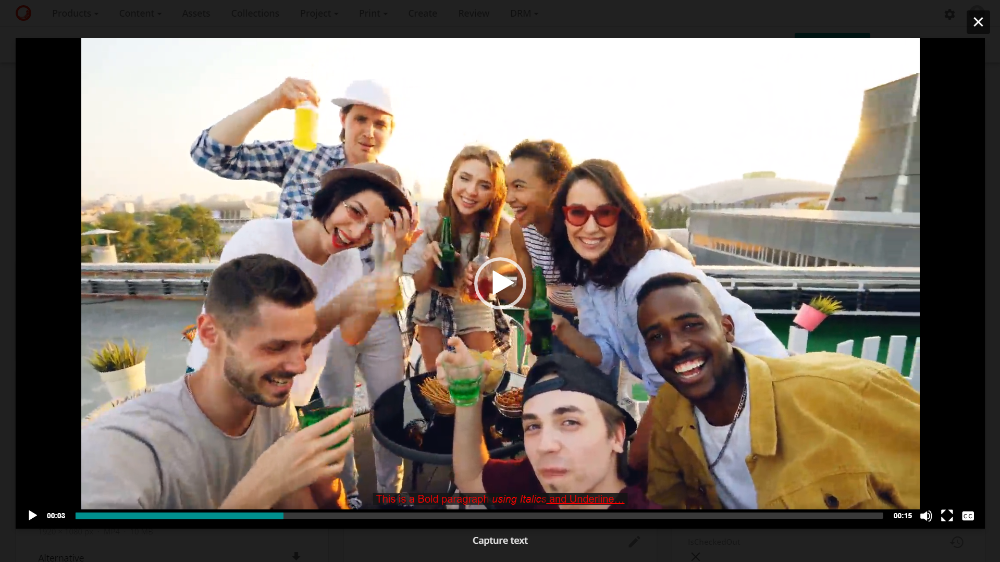

## 字幕ファイルのアップロード

ビデオアセットの詳細ページには、**ビデオ字幕** という名前の領域があります。**ファイルアップロード**ボタンをクリックします。


新しいモーダルが開き、ファイルを選択することができます。アップロードを開始するには、**Select files** をクリックし、字幕ファイルの場所に移動します。


アップロードが完了したら、完了ボタン  をクリックします。


字幕ファイルをアップロードしたら、字幕表示に使用するクローズドキャプションラベルの言語を選択する必要があります。

アップロードされた字幕ファイルを編集するには、鉛筆アイコン の編集機能をクリックしてください。


ドロップダウンリストから字幕の言語を選択してください。

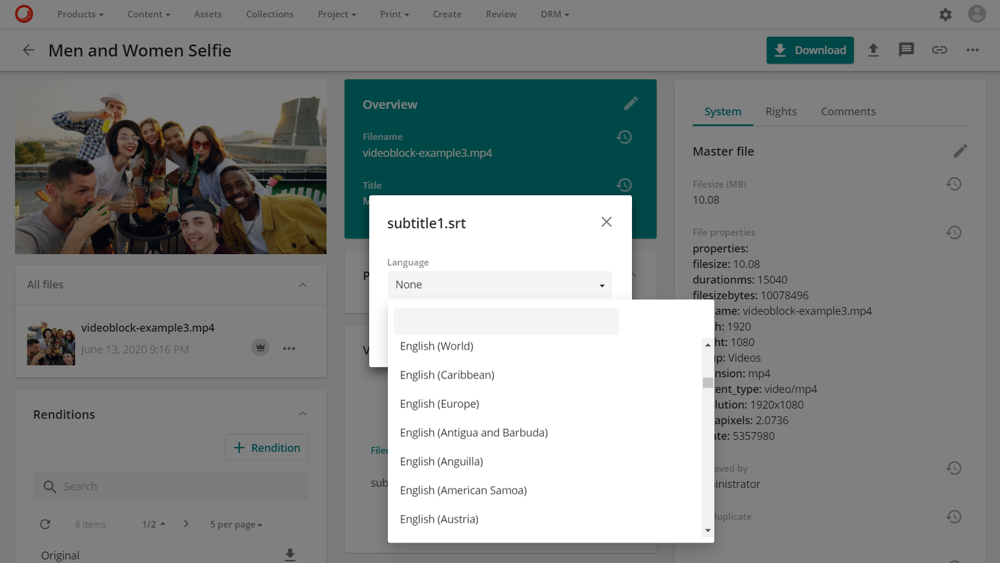

必要な言語が選択されたら、保存ボタンボタンをクリックします。


言語が指定されていない場合、言語はデフォルトで **en-US** として読み込まれます。

これで字幕ファイルが使用できるようになりました。

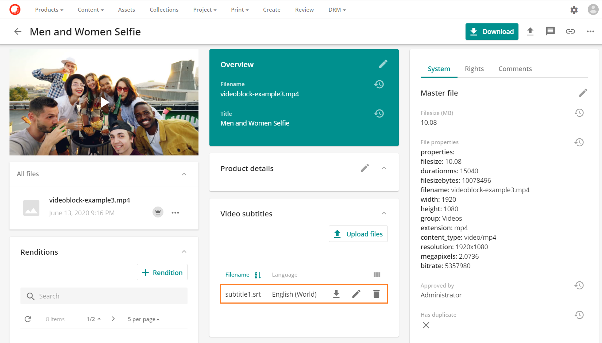

オプションがあります。

*  字幕ファイルをダウンロードします。
*  字幕ファイルを編集します。
*  字幕ファイルを削除します。

## 字幕ファイルの表示

ビデオアセットにオーバーレイされた字幕ファイルを表示するには、ビデオアセットのサムネイル上の再生ボタンをクリックします。


開いたメディアプレーヤーのモーダルには、右下に表示されているクローズドキャプションボタンのクローズドキャプションボタン があります。このボタンには、利用可能な言語のリストが表示されます。


言語をクリックすると、**.srt** ファイルまたは **.sub** ファイルに含まれるテキストを使用して字幕が表示されます。


## 字幕のフォーマット

字幕の出力をカスタムCSSで変更することができます。この変更はすべての字幕に対して行われ、個々の字幕に対しては行われません。

スーパーユーザーは、**管理メニュー**の下にある**ページ管理**セクションの**アセット詳細（ビデオ）**ページに移動します。

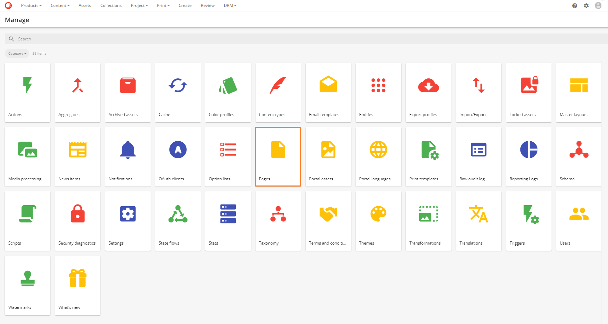

**ページ**で、**アセット詳細（動画）**ページを検索して選択します。

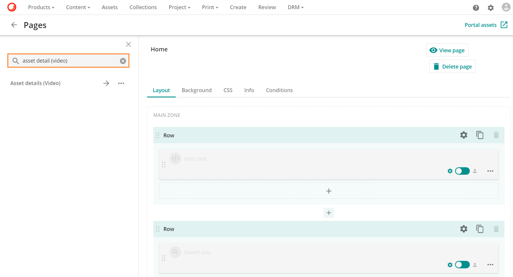

**アセット詳細（動画）**ページで、**CSS**タブを選択します。


CSSを編集するには、CSSタブの編集ボタン ボタンをクリックします。

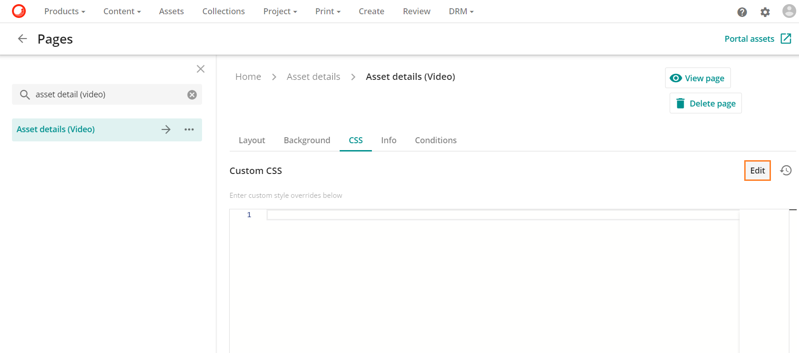

**Custom CSS**テキストフィールドに必要なCSSを追加します。

次の例は、*.mejs_aption-layer MediaElement.js* ライブラリを変更しています。

```
.mejs__captions-layer {
    color: yellow;
    font-size: 3vw;
    line-height: 20px;
    text-align: center;
}
```

この行は**カスタムCSS**の欄に追加されています。

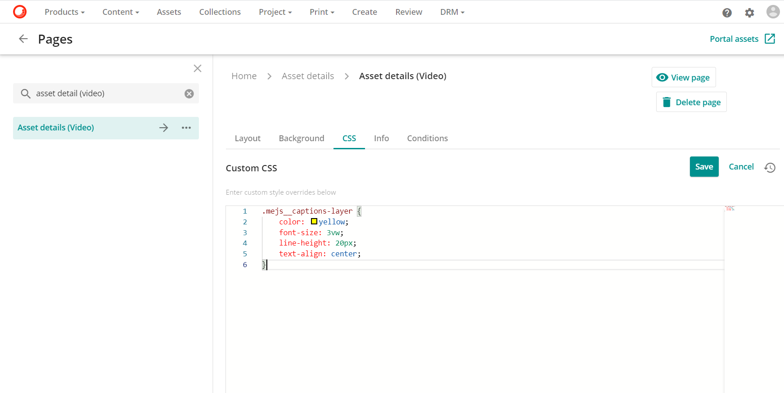

### 字幕色

カスタム CSS で使用される CSS カラー オプションには、必要な色を選択するためのカラー パレットが含まれています。パレットを表示するには、ユーザーは色の値の上にカーソルを置きます。または、HTMLに含まれる140の色名の中から色の名前を挿入することもできます。色の一覧は、[HTMLの色](https://www.w3schools.com/colors/colors_names.asp)を参照してください。


### 字幕のフォントサイズ

フォントサイズは **vw** の任意の値を指定します。**vw** の値はビューポート、つまりブラウザのウィンドウサイズに相当します。例えば、ビューポートの幅が50cmの場合、1vw = 0.5cmとなります。

### 字幕の行の高さ

線の高さの値は、テキストの行間の垂直方向の距離です。ウェブ上では、1行のテキストの上と下のスペースが等しくなっています。ラインハイトの値はピクセル単位で、pxの測定値を使用しています。行の高さは通常、フォントサイズよりも約20%大きくなります。例えば、フォントサイズが14pxの場合、line-heightは約16.8pxになります。**vw**に大きな値を使用している場合は、行の高さを調整する必要があるかもしれません。

### 字幕のテキストアライメント

text-alignプロパティは、テキストの水平方向の整列を設定するために使用されます。テキストを整列させることができます。

* **Left**: テキストを左に揃えます。
* **Right**: テキストを右に揃えます。テキストを右に揃えます。
* **Center**: テキストを中央に配置します。テキストを中央揃えにします。

完了したら、保存ボタン ボタンをクリックして、変更内容を保存します。

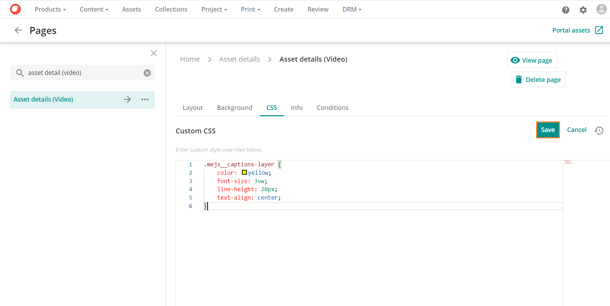

これで、このカスタムCSSがSitecore DAMにアップロードされたすべての字幕に反映されるようになりました。


以下の表は、Sitecore DAMで字幕に反映されるカスタムCSSで作成したフォントの色を変更したものです。

| カラー 	| 字幕の色 	|
|-	|-	|
|  	|  	|
| 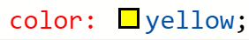 	|  	|
| 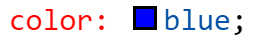  	|  |
 
以下の表は、Sitecore DAMで字幕に反映されるカスタムCSSのフォントサイズの変更点です。

| フォントサイズ 	| 字幕サイズ 	|
|-	|-	|
| 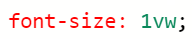 	|  	|
| 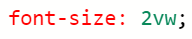 	|  |
|  	|  |
| 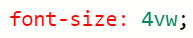 	|  |

以下の表は、Sitecore DAM で字幕に反映されるカスタムCSSの行の高さサイズに変更を加えたものです。

| フォントを使用した行の高さ 5vw  	| 行の高さがある字幕 	|
|-	|-	|
|  	|  |
|   	|  |

以下の表は、Sitecore DAMで字幕に反映されるCustom CSSのtext-alignmentの変更点です。

| カスタムCSSのテキストアライメント 	| 字幕にテキストアライメントを反映させる 	|
|-	|-	|
|  	|  	|
|  	|  	|
|  	|  	|


> [!Note]
> アセット詳細（動画）ページのカスタムCSSを編集した場合、CSSの変更内容を表示する前にアセット詳細（動画）ページを更新する必要があります。
