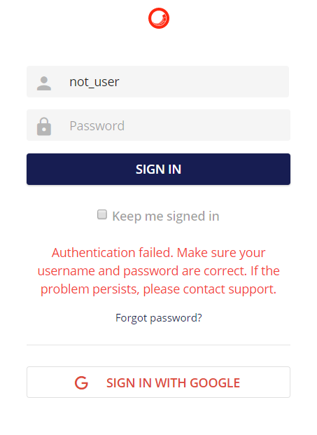

# 認証

Webブラウザを使用して、Sitecore Content Hubアプリケーションに移動します。

**ログインページ**

ユーザーはユーザー名とパスワードを入力し、SIGN IN ボタンをクリックする必要があります。

入力されたユーザー名とパスワードの組み合わせが間違っている場合は、ログインモーダルに警告が表示され、ユーザーに通知されます。"認証に失敗しました。ユーザー名とパスワードが正しいことを確認してください。問題が解決しない場合は、サポートにご連絡ください。

**ログインエラーメッセージ0**

`Keep me signed in` のチェックボックスをオンにすると、次回の訪問時にユーザー名を入力しておくことができます。

さらに、ユーザーは、Microsoft、Google、WS Federation、SAMLのアカウントを使用して認証を行い、Sitecore Content Hubのプロフィールにリンクさせることができます。これらは、管理用の「設定」ツールで有効化/無効化することができます。

ウェブブラウザの設定によっては、入力されたパスワードを次回の訪問時に記憶させることができます。

> [!Note]
> Web ブラウザセッションは、ログインポータルの言語文化を決定するために地域設定を自動的に使用します。このカルチャがサポートされていない場合、ウェブアプリケーションは自動的にデフォルトのカルチャにフォールバックします。このデフォルトのカルチャは管理者が設定できます。
> 
