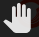
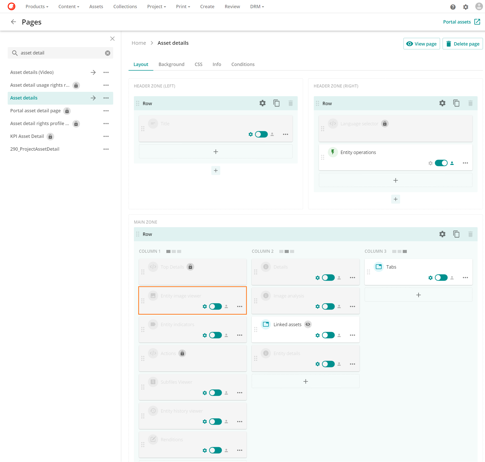
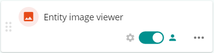

# プレビューとディープズーム

ディープズームは、アセットプレビューをアクティブに表示できる機能です。

これにより、ユーザーは、元の画像の小さなプレビューを拡大して表示する際の通常のぼやけやピクセル化をすることなく、大きな画像を高解像度でパンしてズームインすることができます。ページに合わせた画像を開くことで、画像の最初の読み込みとユーザーへの表示に必要な時間を最小限に抑えることができます。このページに合わせた画像を開くことで、ユーザーは画像を拡大、縮小、パンすることができます。

## プレビューのディープズーム

ディープズーム機能は、アセットの[インラインプレビュー](../../administration/portal/pages/page-components/search-component/output-section.md#inline-preview)ページで利用できます。インラインプレビューページは、アセット検索ページで**プレビュー**操作をクリックするか、虫眼鏡アイコンの拡大鏡アイコン が開いているアセット詳細ページでアセットのプレビュー画像をクリックしてプレビューページを開くことができます。

続いてインラインのプレビューページが開き、 ページにフィットした画像が表示されます。

インラインプレビューには、左上隅にアイコンメニューバーがあります。

利用可能なオプションは以下の通りです。

*  **パン**: 画像がズームインされている場合、このオプションは画像ビューアでの画像の位置をコントロールすることができます。

* "[メニューバーのズームアウトアイコン](../../../images/user-documentation/content-user-manual/preview/_user-documentation_content-user-manual_preview_3.2.1_zoom_out_icon.png) **ズームアウト**: このオプションは画像をズームアウトすることで画像のサイズを縮小します。

* "[メニューバーのズームインアイコン](../../../images/user-documentation/content-user-manual/preview/_user-documentation_content-user-manual_preview_3.2.1_zoom_in_icon.png) **ズームイン**: このオプションでは、優れた画質を維持したまま、画像の一部を拡大してサイズを拡大することができます。

* **サイズメニュー**: このオプションは様々なオプションを提供することで、ユーザーが画像のサイズをより良くコントロールできるようにします。

  

  * **幅に合わせる**: このオプションは画像の幅を視聴者の幅に合わせて調整します。
  * **ページに合わせる**: このオプションは画像の幅と高さをビューアの幅と高さに合わせます。このオプションは画像の幅と高さを視聴者の幅と高さに合わせます。
  * **プリセット値**: これらのオプション (例: 10%, 25%, 50%) は選択された値に応じて画像の寸法を調整します。
  * **マーキーズーム**: このオプションでは、ユーザーが画像の特定の領域をズームインすることができます。

## ディープズームを無効にする

ページの設定に応じて、[検索コンポーネント](#search-component) やエンティティ画像ビューアでディープズーム機能を無効にすることができます。

### <a name="search-component" />検索コンポーネント

以下の手順では、この機能を無効にする方法を説明します。

* ディープズームを無効にする必要がある検索コンポーネントに移動します。

  1. **管理** に移動します。
  2. **ページ** に移動します。
  3. **検索**コンポーネントを含むページを検索します（例：アセット）。
  4. 検索コンポーネントをクリックして編集します。

* 検索コンポーネントで、**出力** タブに移動し、**インライン プレビュー** を選択します。

* **インラインプレビュー**で、**ディープズーム無効** ボタンをトグルして、この機能を無効にします。

  

* 検索コンポーネントを**保存して閉じます**。

### エンティティ画像ビューア

エンティティ 画像ビューア コンポーネントでは、**ディープ ズームを無効にする** スイッチを *オン* に切り替えることで、ディープ ズームを無効にします。

次の例では、 **アセットの詳細ページ**で**ディープ ズーム**が無効になっています。

1. **アセットの詳細**ページに移動し、**エンティティ イメージ ビューア**を探します。

2. カスタム設定を有効にするスイッチをトグルします。

  

3. その他のアクションアイコンで、「編集」を選択します。

  

4. ディープズームを無効にするスイッチをオンに切り替えます。

  

5. **保存と閉じる**をクリックして終了します。
