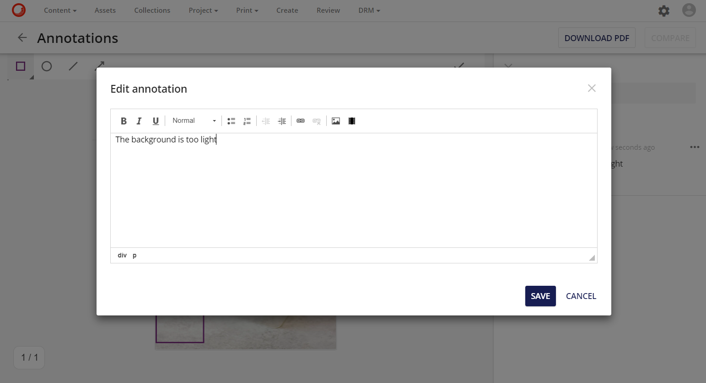

# アノテーションメニュー

アノテーション ページでは、ユーザーはサイド パネルでアセットのアノテーションの全リストを表示できます。アノテーションパネルでは、アノテーションメニューからアノテーションに対する特定の操作を行うことができます。

アノテーションメニューでは、以下の操作が可能です。

* 編集
* 新しいコメント
* 削除
* 選択

## 編集
編集操作は、関連するアノテーションのテキストを編集します。

## 新しいコメント
新規コメント操作は、関連するアノテーションに返信(サブコメント)を追加します。

## 削除
削除操作は、関連するアノテーションを削除します。

## 選択

選択操作は、メインパネルで関連するアノテーションを選択します。

メイン パネルでアノテーションを選択すると、アノテーションがハイライト表示され、ユーザーは以下の操作を行うことができます。

* アノテーションスタイルを編集します。
* アセットの周りにドラッグ アンド ドロップしてアノテーションを移動します。
* アノテーションを削除します。

