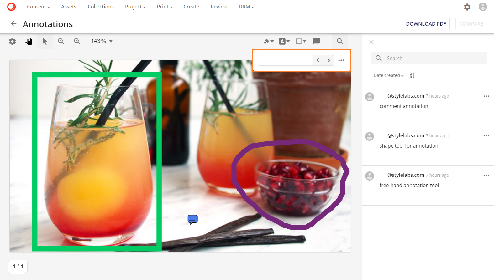

# アノテーションツール

アノテーション ページには、複数のアノテーション ツールが用意されています。ここでは、利用可能なツールについて説明します。

## ページの設定

ページ設定は、ユーザーがより良いビューコントロールアイコンを使用して、アノテーションページのアセットのレイアウトを調整するのに役立ちます： 。PDFアセットでも画像アセットでも、ユーザーは自由にレイアウトを回転させて更新することができます。

### ページの遷移

* ページごとのページ遷移 
* 連続的な連続ページ遷移 

### レイアウト

* シングル 
* ダブル 
* 表紙 

### 回転

* 反時計回りに回転させる 
* 時計回りに回転させる 

## アノテーションの種類

利用可能なアノテーションツールは、メディアタイプごとに異なります。

### フリーハンドアノテーション

フリーハンドアノテーションは、ユーザーが自由に自分のアノテーションマークアップを描くことを可能にします。豊富なカラーパレットの中から、線の太さや色を自由に選ぶことができます。

### テキストのアノテーション

テキストアノテーションは、ユーザーがPDFアセットのテキストコンテンツにアノテーションを付けることができます。このツールは、テキストを強調表示するための豊富なカラーパレットだけでなく、下線、エラーライン、取り消し線などの様々なテキスト形式を提供しています。

### シェイプされたアノテーション
アノテーションツールには、長方形、円、線、矢印のような規則的な形状のアノテーションもあります。定形アノテーションでは、豊富なカラーパレットとカスタマイズ可能な線の太さを選択することができます。

## 検索ツール

アノテーションツールでは、PDFアセットのテキスト内容を検索するテキスト検索ツールを提供しています。

検索ツールには、大文字小文字の区別の一致や単語全体の検索などの高度な検索パラメータが用意されています。

