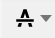
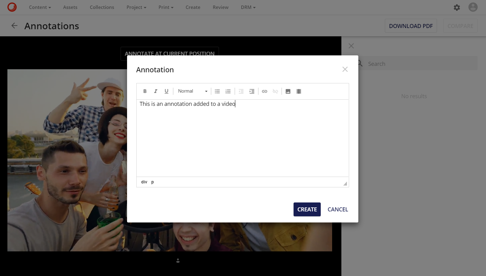

# アノテーションとメディアタイプ

アノテーションは以下のメディアタイプに対応しています。

* 画像アセット
* PDFアセット
* ビデオアセット
* オーディオアセット

利用可能なアノテーションツールはメディアタイプごとに異なります。アノテーションツールの詳細については、[このセクション](annotation-tools.md)を参照してください。

## 画像アノテーション

画像アセットに対しては、ユーザーは任意の組み合わせを使ってアノテーションを作成することができます。

* **フリーハンドツール**: 
* **形状ツール**： 
* **コメント**： 

## PDF アノテーション

PDF アセットの場合、ユーザーは任意の組み合わせを使用してアノテーションを作成することができます。

* **フリーハンドツール**: 
* **テキストツール - ハイライト**: 
* **テキストツール - 下線**: 
* **テキストツール - 下波線**: 
* **テキストツール - 取消線**: 
* **形状ツール**: 
* **コメント**: 

## ビデオ/オーディオアノテーション

ビデオアセットとオーディオアセットには、時間ベースのアノテーションを設定することができます。動画/音声ファイルを再生した後、**現在位置にアノテーションを付ける**ボタンをクリックすると、動画/音声ファイルの正確な瞬間にアノテーションを設定することができます。

ボタンをクリックすると、新しいモーダルウィンドウが表示され、ユーザーがアノテーションを入力することができます。

アノテーションが作成されると、アノテーションの瞬間（ファイルのプログレスバーの下）に新しいインジケータが表示されます。インジケータをいつでもクリックすると、ユーザーはビデオ/オーディオファイル内のアノテーションの正確な瞬間に移動できます。

