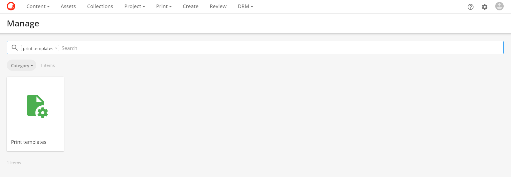
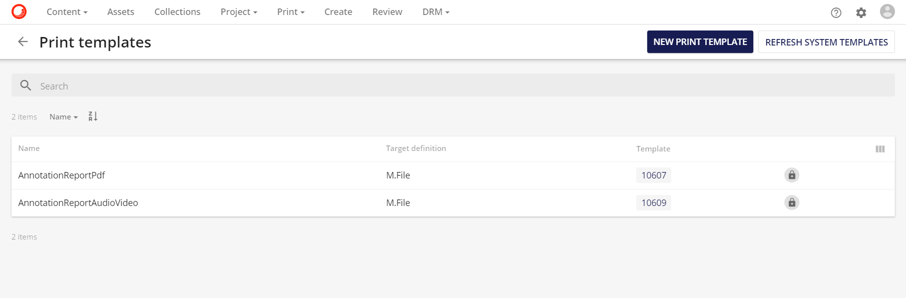

# アノテーションレポート

**アノテーションレポート**は、アセットのレビューと承認プロセスにさらなる機能を追加します。査読者によるアセットのアノテーションは、PDFレポートでダウンロードすることができ、アノテーションに直接アクセスできないかもしれないが、それに対応して行動するためにこれらを見る必要がある外部機関と共有することができます。

あらゆるタイプのアセットのアノテーションレポート

* **画像**
* **ベクター**
* **書類の提出先**
* **動画**
* **オーディオ**

レビュー役であるブランドマネージャーは、マーケティングアセットにアノテーションを追加します。しかし、レビューのアノテーションに基づいてコンテンツを編集することになる広告代理店は、システムアクセス権を持っていないため、レビュープロセスにブロックが発生します。PDFアノテーションレポートを作成することで、このブロックは取り除かれ、PDFアノテーションレポートをダウンロードして広告代理店にメールで送信することができます。

また、**@mentions**にも対応しており、外部の広告代理店や代理店へのメール送信にも利用できます。

*@EMAIL_ADDRESS*を挿入することで、外部機関に影響を与えるアノテーションがあることを通知し、PDF形式でアノテーションレポートを要求するようにします。

## テンプレートファイルのインポート

注釈レポート操作は、PDFファイルを生成します。これは、ユーザーがインストールする必要がある2つの印刷テンプレートZIPファイル（AnnotationReportPdfとAnnotationReportAudioVideo）に依存します。

これらの印刷テンプレートをインストールするには、[管理] に移動し、[印刷テンプレート] を検索します。

**印刷テンプレート**ページで、**システムテンプレートの更新ボタン**をクリックします。システムテンプレートをリフレッシュすると、印刷テンプレートが自動的に設定され、アノテーションレポートの印刷操作が正常に機能するようになります。

## 単一アセットのアノテーションレポート

単一アセットの**アノテーションレポート**をダウンロードするには、アノテーションボタン をクリックして**アノテーション**ページに移動します。

アノテーション ページで、 ボタンをクリックします。

**アノテーションレポート**は、ユーザーアイコンの下にある**ジョブ**オプションで利用可能な状態で表示されます。

## アノテーションレポート形式

**アノテーションレポート**のフォーマットはアセットタイプごとに異なります。

### オーディオとビデオのアセットタイプのフォーマット

オーディオとビデオのアノテーションレポートには、レポートに含まれる各アノテーションのタイムスタンプが含まれています。

ただし、ビデオアセットの**アノテーションレポート**には、**アノテーションレポート**の最初にビデオコンテンツを表す静的画像プレビューが含まれます。

### 画像とベクター

画像やベクターのアノテーションレポートでは、画像やベクターのプレビューとその下にあるアノテーションが表示されます。

