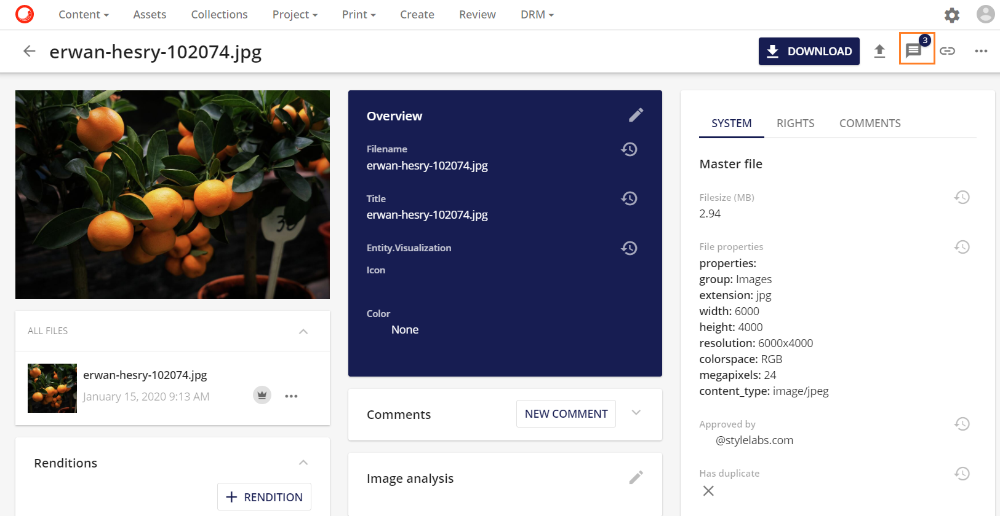

# アノテーション

Sitecore Content Hubでは、アノテーションとは、あらゆるタイプのコンテンツにコメントをつけるための方法です。アノテーションの主な目的は、フィードバックを与えてコンテンツを確認することです。ユーザーは共同で新しいコメントを追加したり、他のコメントに返信したりすることができます。

## アノテーションのページ
アノテーションのページでは、ユーザーがアセットにコメントを追加することができます。アノテーションは高度なカスタマイズが可能で、さまざまな形や色があります。

アノテーションページは2つの部分で構成されています。

* メインパネルでは、アセットとアノテーションを表示することができます。
* サイドパネルでは、アノテーションのテキスト（コメント）やコメントに対する他のユーザーからの返信を表示することができます。

## アノテーションのページへ

以下の画像のように、アノテーションボタンをクリックすると、**アセット詳細**ページからアノテーションページに移動することができます。

アノテーションボタンには、アセットの既存のアノテーションの数を表示するインジケータもあります。次の例では、アセットには 3 つのアノテーションがあります。

アノテーションの詳細については、以下のセクションを参照してください。

* [アノテーションとメディアタイプ](annotations-media-type.md)
* [アノテーションツール](annotation-tools.md)
* [アノテーションアクション](annotation-actions.md)
* [サイドバイサイド比較](annotation-side-by-side-comparison.md)
