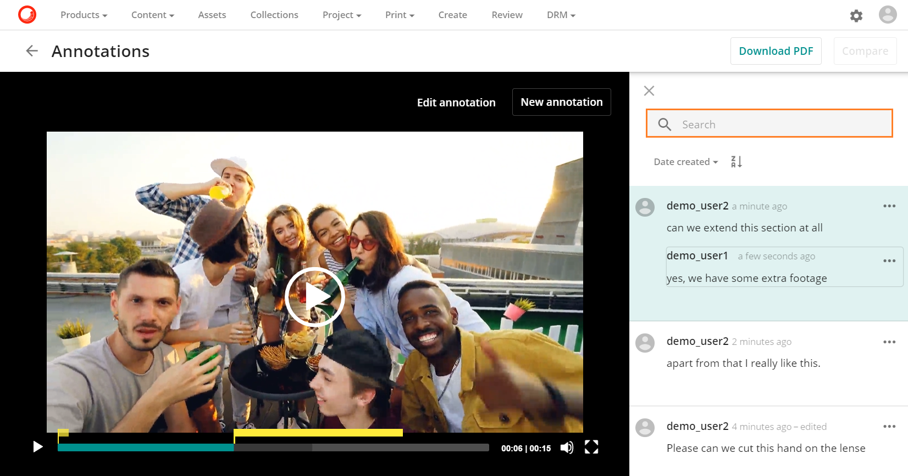
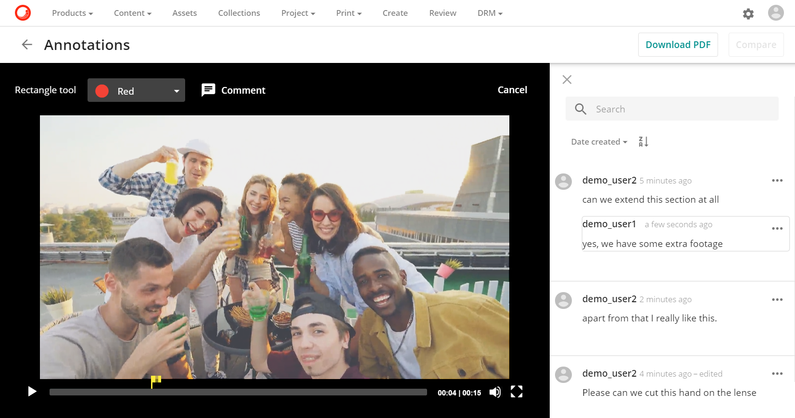
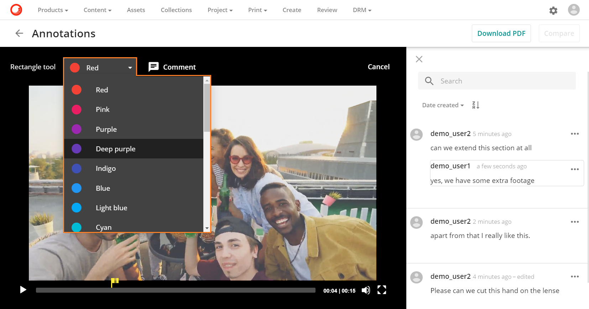
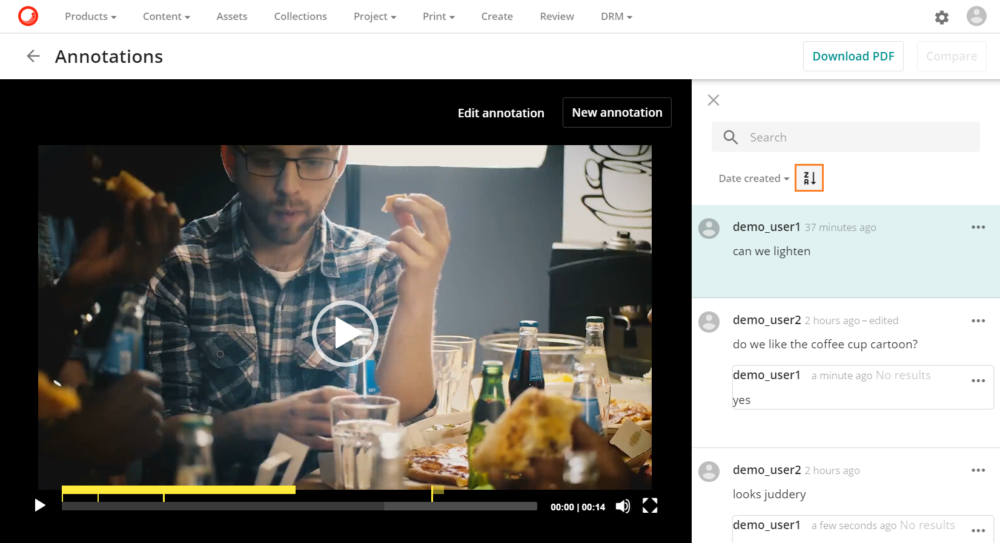
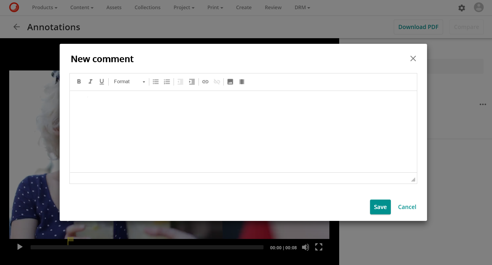
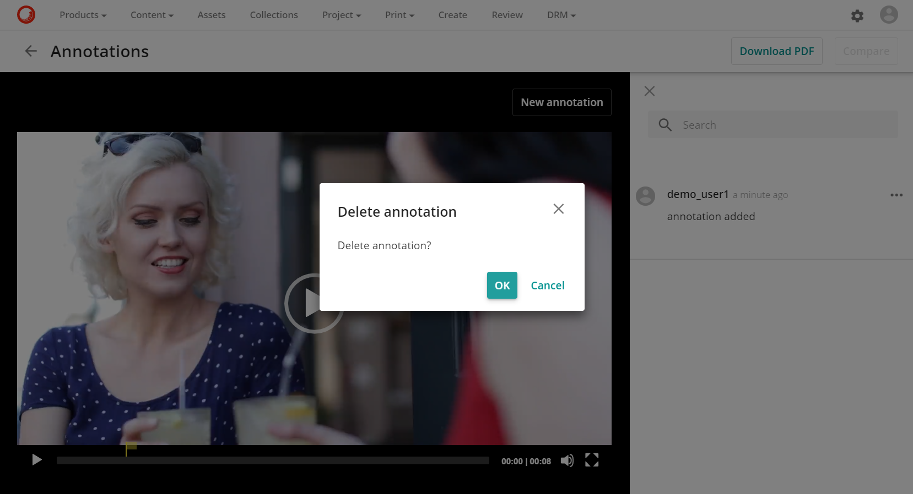
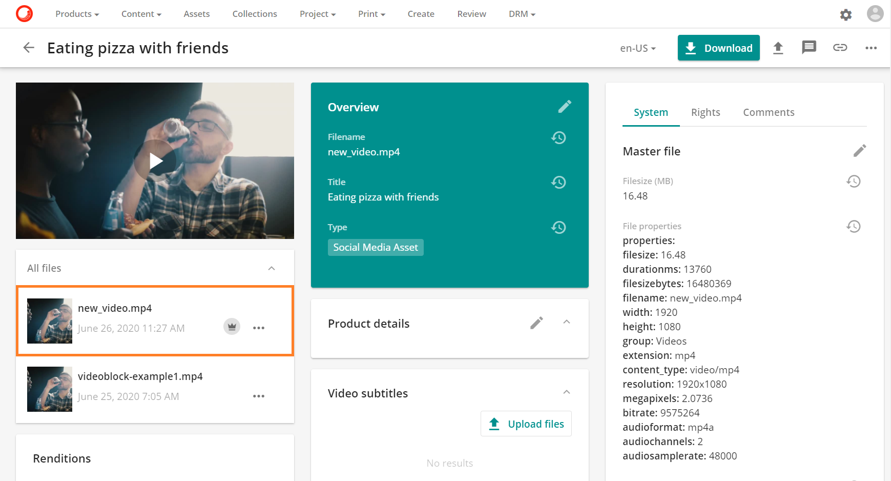

# ビデオアノテーション

**ビデオアノテーション**機能では、単一のポイントだけでなく、時間範囲に広がったアノテーションを含む、アノテーションコメントや形のあるハイライトをビデオアセット上で作成することができます。アノテーションの主な目的は、ユーザーがフィードバックを提供できるようにすることで、ビデオアセットをレビューすることです。

ユーザーは、新しいコメントを追加したり、他のコメントに返信したりすることで、共同作業を行うことができます。

## 動画のアノテーションにアクセスする

動画のアノテーションには、動画のアセット詳細ページにあるアノテーションアイコン  からアクセスできます。このアイコンには、動画アセットに入力されたアノテーションの数が表示されます。

## アノテーションのページ

アノテーションページの中央ゾーンにはアノテーションビューアがあり、サイドバーにはコメントのテキストコンテンツと検索ボックスがあります。

### 新しいアノテーション

**新しいアノテーションボタン**：アノテーションビューアを**プレイ**モードから**アノテーション**モードに切り替えることができます。

動画プレーヤが明るくなり、**アノテーション**モードに移行したことが示され、動画にアノテーションを付けるためのさまざまなオプションやツールが表示されます（**四角形ツール**や**コメント**機能など）。

### アノテーションの取り消し

**キャンセル**ボタンは、アノテーションビューアを**アノテーション**モードから**プレイ**モードに戻すためのボタンです。

### 矩形ツール

**矩形ツール**は、ビデオフレーム内の領域を選択するために使用されます。矩形ツールの**カラーピッカードロップダウン**では、矩形マークアップの色を選択することができます。

マウスの左ボタンを使ってドラッグセレクトすることで領域を選択します。ドラッグ選択とは、画面上の任意の場所をクリックしてマウスの左ボタンを押したまま、カーソルを別の場所にドラッグすることです。この操作では、ドラッグの最初から最後までのすべてがハイライト表示され、矩形ツールに含まれます。

マウスを離すと、アノテーションコメントボックスが表示され、ここに矩形ツールに関連付けるテキストアノテーションを入力することができます。完了したら、[作成]をクリックします。

> [!Note]
> 矩形の形状のみ、矩形ツールから利用可能です。

### コメントを追加

**コメント**ボタンでは、テキストコメントを作成し、アノテーションを保存することができます。

**コメント**ボタンをクリックすると、アノテーションボックスが表示され、ユーザーはテキストコメントを作成することができます。ユーザーはアノテーションを入力し、**作成**をクリックします。

### アノテーションフラグ

アノテーションフラグ は、動画内の特定のアノテーションポイントをハイライト表示し、ユーザーがアノテーションに必要な時間帯を選択できるようにします。

アノテーションフラグの右側をクリックし、ドラッグしてアノテーションの時間範囲を選択します。

コメントボタンのコメントボタンをクリックして、  でアノテーションを追加します。

作成ボタン  をクリックすると、アノテーションが作成され、画面右側で利用できるようになります。

### アノテーションの編集

**アノテーションの編集**ボタンでは、コメントを編集したり、アノテーションの変更を保存したりすることができます。

### 変更を保存

変更を**保存ボタン**では、アノテーションと時間範囲の変更を保存することができます。

### キャンセル

**キャンセル**ボタンでは、アノテーションの作成や変更をキャンセルすることができます。

## サイドバー

サイドバーの**全文検索**では、アノテーションコメントから検索することができます。

### 並べ替えオプション

**並べ替えオプション**では、アノテーションコメントをソートすることができます。**作成された日付**がデフォルトのソートオプションですが、ソート方向を逆にするオプションを使用してソートを逆にすることができます。

### アノテーション操作

**メインクリックエリア**では、任意のアノテーションコメントをクリックすると、アノテーションがアノテーションビューアに表示されます。

アクション  このボタンでは、各アノテーションコメントにドロップダウンメニューが表示され、以下のオプションがあります。

* **コメントを編集**すると、既存のコメントを編集することができます。

    

  新しいモーダルが開き、既存のコメントを編集可能な形式で表示します。

    

* **新しいコメント** では、新しいアノテーションコメントを作成することができます。

    

  新しいコメントボックスが開き、ユーザーがテキストコメントを入力することができます。

    

* **削除**はコメントを削除することができます。ユーザーは自分のコメントのみを削除することができ、他のユーザーのコメントは削除できません。

    

  削除の確認を求める確認ボックスが表示されます。

    

> [!Warning]
> 画面にビデオ字幕が表示されている場合、ユーザーはビデオアノテーションを追加することはできません。ユーザーがアノテーションを追加したい場合は、**CC** ボタンで**なし**を選択して字幕をオフにする必要があります。

## 新しいビデオのアップロード

新しい動画がアセットの新しいバージョンとしてアップロードされた後に

アノテーションは、「すべてのファイル」ボタン をクリックしても表示されます。このボタンをクリックすると、以前のアセットバージョンで作成されたアノテーションを表示するためのオプションが表示されます オプションがメニューに表示されています。

> [!Warning]
> 動画のアノテーションに返信できるのはスーパーユーザーのみです。この問題は後のリリースで解決される予定です。

