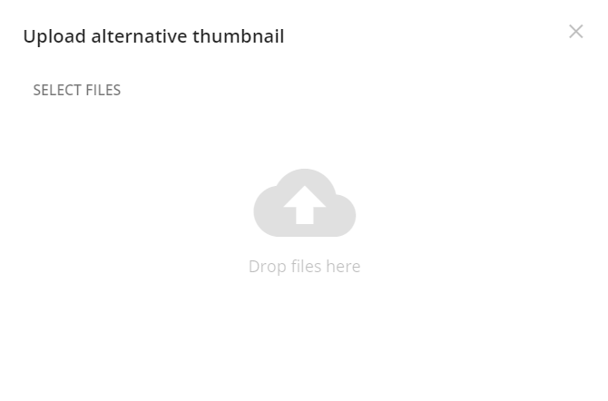
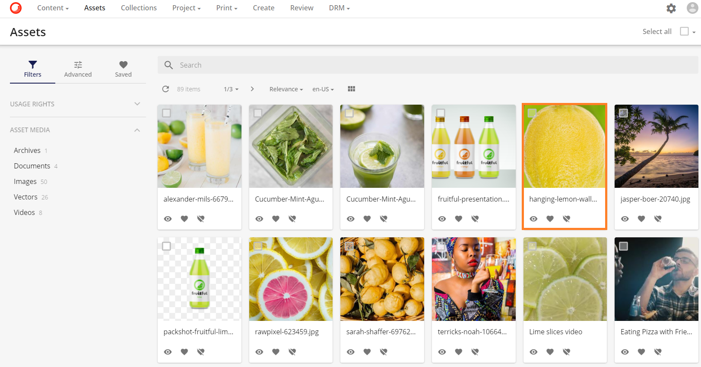
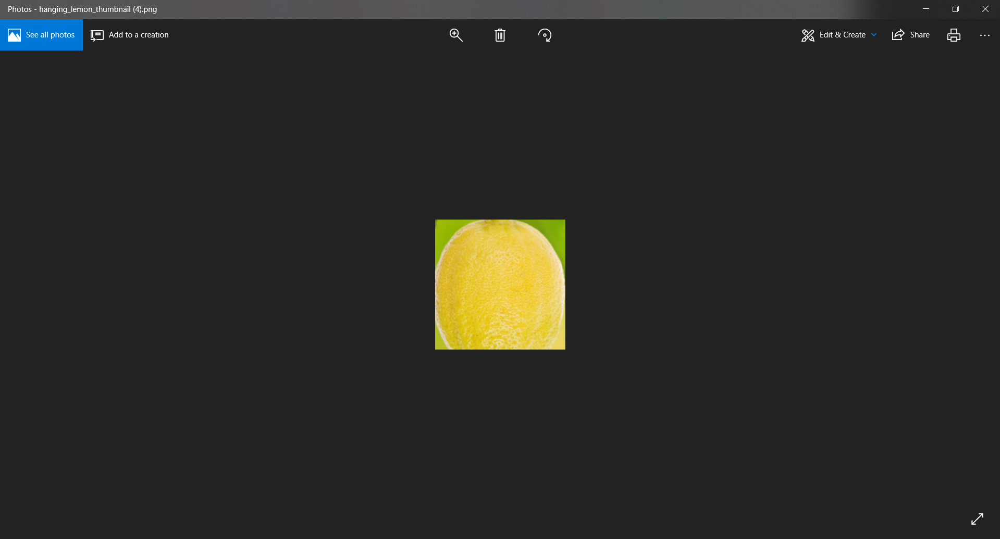

# 代替サムネイルのアップロード

**代替サムネイルをアップロード**すると、マスターファイルバージョンのサムネイルの代替バージョンをアップロードすることができます。

**代替サムネイルのアップロード**オプションは、アセット詳細ページの右上の操作メニューにあるアップロードアイコンボタン で選択できます。

新しいモーダルが開き、ファイルを選択するか、ファイルをドラッグ＆ドロップすることで、サムネイルとして使用する新しいファイルをアップロードすることができます。

ファイルの場所に移動し、ファイルを選択します。または、必要なファイルをモーダルにドラッグ＆ドロップします。

新しいファイルが元の**サムネイル**のレンダリングと**プレビュー**のレンダリングを置き換えるまでに少しの遅延があります。

| アップロードされたファイル | サムネイル |
|-	|-	|
|  |  |

しかし、新しいプレビューは**アセットの詳細ページ**だけでなく、**アセットページ**にもプレビューとして表示されます。

オリジナル版はレンディションでも利用できますが、サムネイルとプレビューのレンディションは以前にアップロードした新しいサムネイルに変更されています。

| サムネイルのレンディション |
|- |
|  |

| プレビューレンディション |
|- |
|  |

| オリジナルレンディション |
|- |
|  |
