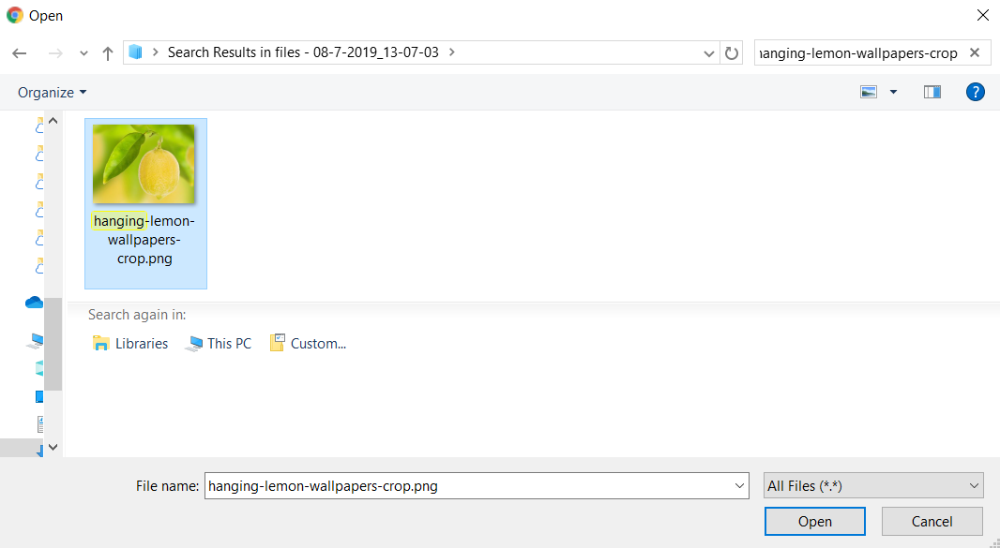
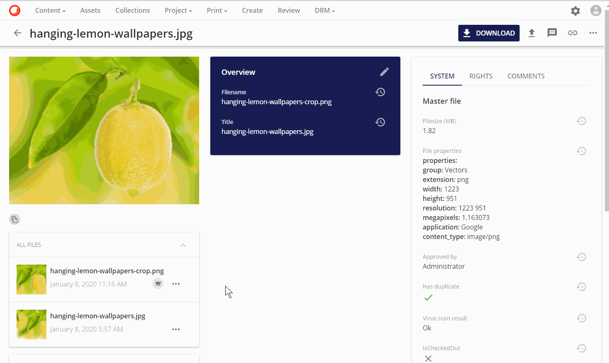

# アップロードファイル

**アップロードファイル**は、選択したアセットの新しいバージョンをアップロードすることができます。

**アップロードファイル**は、**アセット詳細ページ**の右上の操作メニューにあるアップロードアイコン のボタンアイコンの下に表示されます。

ファイルの選択を開始するには、**ファイルの選択**オプションをクリックします。

アップロードするファイルに移動し、**開く**をクリックします。続いてファイルがアップロードされます。

または、選択したファイルを「ファイルの選択」にドラッグ＆ドロップしてアップロードします。

アップロードが完了すると、アップロードされたファイルがマスター として設定されます。このプロセスは、アセットの新しいバージョンに合わせて新しいレンディションが作成されるため、1分程度かかる場合があります。

## アセットファイルのバージョン

アセットが複数のバージョンのファイルを持つと、いくつかのオプションがあります。バージョニングの詳細については、バージョニングを参照してください。

### マスターとして設定する

以前にアップロードしたファイルをアセットのマスターとして設定する場合は、アイコンをクリックすると、選択したファイルをマスターとして設定するオプションを含む様々な操作が表示されます。

### マスターと比較する

任意のファイルバージョンをマスターファイルのバージョンと比較するオプションがあります。

マスターと比較オプションは、左側にマスターバージョンが表示され、右側に選択されたバージョンが表示された新しいモーダルを開きます。どちらかのバージョンをより多く表示できるように、差分を表示するスライダーボタンがあります。

> [!Note]
> アップロードファイルと代替サムネイルのアップロードの違いにご注意ください。
> * ファイルをアップロードする場合は、アセットのマスターファイルバージョンとして設定されているアセットの新しいファイルバージョンをアップロードします。
> * 代替サムネイルのアップロードは、アセットのマスターファイルのバージョンに合わせた新しいサムネイルのみをアップロードします。[代替サムネイルのアップロード](upload-alternative-file.md)の詳細は以下の通りです。
