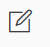
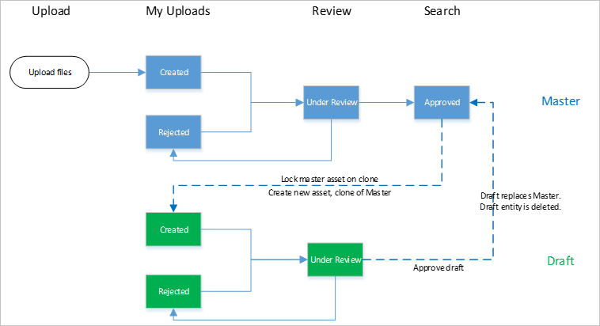

# バージョン

下書きは、アクション・ボタン  の編集から**アセット詳細**ページで作成することができる。次の図は、製品内の Asset エンティティに適用されるバージョン管理の原則と、そのステータス遷移の可能性を示しています。

*バージョニングイラスト*

ドラフト エンティティは、マスター アセットのコピーであり、同じファイル参照、リレーション、メタデータ構成を持っています。

ドラフトが作成されると、マスター アセットは検索でロックされます。

ドラフト アセットは、ステータスの他のアセットと同じパスに従います。作成済み、却下済み、または審査中の他のアセットと同じパスをたどることになります。メタデータを更新したり、新しいファイルをアップロードしたり、関係を変更したりすることができます。

草案アセットが承認されると、検索でマスターエンティティに置き換わり、データベースから削除されます。