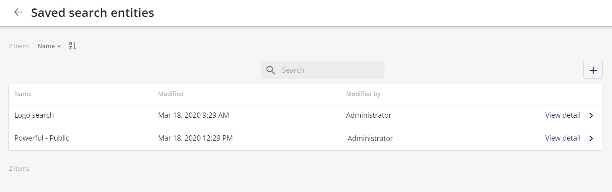
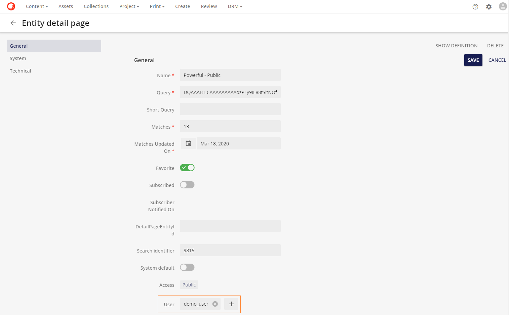
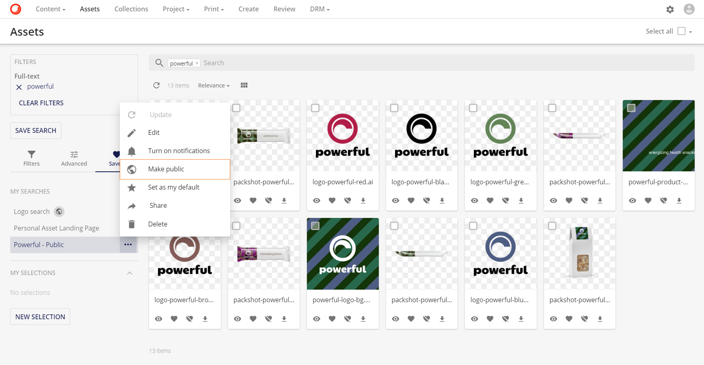

# 検索の保存

テクノロジーのパーソナライゼーションがますます進む中、ユーザーはアプリケーションを使用する際に、よりパーソナライズされた体験を求めています。**デフォルトの保存検索**機能を導入することで、**Sitecore Content Hub** のユーザーは、ユーザー体験をパーソナライズすることができます。この機能により、ユーザーがSitecore Content Hubの定義されたページに移動すると、保存された検索が自動的に有効になります。この自動的に有効化された検索により、ユーザーが抱えるいくつかの問題が解決されます。

以下のドキュメントでは、この機能を説明する3つのユースケース例を紹介します。

## ユースケース1

ユーザーは、必要なアセットを見つけるのに苦労するかもしれません。デフォルトの保存検索では、ユーザーは必要なアセットのみを見ることができます。この場合、ユーザーはFruitfulで全文検索を使用して公開保存検索を作成しています。公開保存検索は、地球儀で表示される地球儀アイコンの公開検索アイコンで識別することができます 

> [!Note]
> 保存された検索が作成されると、デフォルトでは非公開になります。そのため、保存された検索が作成されると、その作成者のみが閲覧できるようになります。
> つまり、Make publicオプションしか利用できないということです。
> 
> **公開する** を選択すると、**非公開にする** オプションが利用可能になります。

ユーザーは、 をクリックして、使用可能なオプションを表示します。

ユーザーは **公開する** オプションを選択します。

次に、ユーザーは **標準に設定** を選択します。この選択は、次回以降、ユーザーがログインしたときに、この保存された検索の内容が表示されることを意味します。

ユーザーはこのSaved検索をパブリックとして設定しているため、すべてのユーザーがこの検索を利用してデフォルトとして設定することができます。

デフォルトに設定されているSaved検索は、星形のアイコン で識別できます。

### ユースケース動画

[!Video https://mss-p-003-delivery.stylelabs.cloud/api/public/content/fecc8960f98843e4b0cc5f801ca069f4?v=d16cc8d4]

## ユースケース2

事前にフィルタリングされたページに着地するためには、ユーザーのチームが必要です。この例では、**Powerful**の全文検索から返されたアセット。この保存された検索は**public**に設定されています。

スーパーユーザーは**管理**ページに移動し、**エンティティ**を検索します。

**エンティティ**ページで、**M.SavedSearch**を検索します。

必要な保存された検索で**詳細を表示**をクリックします。

**エンティティ詳細ページ**の編集アイコン編集アイコンをクリックすると、保存されている検索を変更することができます。

**Powerful - Public**検索を見るために必要なチームのメンバーであるユーザーは、保存された検索エンティティに追加する必要があります。スーパーユーザーは、ユーザーフィールドのプラスアイコンをクリックして**ユーザー**を追加  をクリックして、ユーザーリストから必要なユーザーを選択します。

さて、このセーブされた検索は、選択されたすべてのユーザーのためのアセットページのデフォルトのセーブされた検索です。

これは**アセットページのデフォルトの保存**検索ですが、ユーザーはフィルターをクリアすることで他のアセットにアクセスすることができます。

また、ユーザーは、アセットを表示する際のデフォルトの保存検索として、自分の個人的な保存検索を設定することができます。保存検索を作成した後、ユーザーは**私のデフォルトオプションとして設定**を選択します。

### ユースケース動画

[!Video https://mss-p-003-delivery.stylelabs.cloud/api/public/content/3028e17ddc624056b0d8bdcc6fc32db6?v=bf2f627c]

## ユースケース3

保存された検索をシステムのデフォルトとして設定することもできます。スーパーユーザーは、保存された**検索を公開**するオプションを選択することで、保存された検索を公開に設定します。

**アクセス**が**公開**に設定されると、**エンティティの詳細**ページに**システムのデフォルト**フィールドが表示されます。このフィールドはアクティブにトグルされています。

これで、任意のユーザーがログインしてアセットページに移動すると、保存された検索がデフォルトで表示されるようになりました。

### ユースケース動画

[!Video https://mss-p-003-delivery.stylelabs.cloud/api/public/content/3028e17ddc624056b0d8bdcc6fc32db6?v=bf2f627c]

## マイ検索ページ

ユーザーページのメニューからマイサーチのページに移動して、保存された検索を編集することができます。

以下のアイコンが利用できます。

| 名前 	| アイコン 	| アクション 	|
|-	|-	|-	|
| 通知をオンにする 	|  	| 保存された検索結果内で変更が発生した場合（例：アセットのメタデータが変更され、保存された検索条件に影響を与える）、ユーザーは通知を受け取ります。	|
| 通知をオフにする 	|  	|  保存された検索結果内で変更が発生した場合（例：アセットのメタデータが変更され、保存された検索条件に影響を与える）、ユーザーは通知を受け取りません。	|
| パブリックにする	|  	| 保存された検索結果は、すべてのユーザーが閲覧できるようになります。	|
| プライベートにする 	|  	| 保存された検索は非表示になり、検索者とすべてのスーパーユーザーのみが利用できるようになります。スーパーユーザーは、エンティティマネージャを介して他のユーザーの非公開保存検索を見ることができます。	|
| クイック編集	|  	| A保存された検索のメタデータを編集できます。 	|
| ユーザーの標準に設定	| 	| 保存された検索を、現在のユーザーのデフォルトの保存検索として設定します。 	|
| ユーザーの標準から削除 	|  	| 保存された検索を、現在のユーザーのデフォルトの保存された検索として解除します。	|
