# コンテンツ検索

検索ページでは、ユーザーの権限に応じて、承認されたコンテンツやアセットを検索することができます。

日常的に使用する場合（ほとんどの読者のプロフィールを意味します）、アセットは検索機能の1つを使用して検索することができます。その後、ダウンロード順序を作成することで、それらを選択してダウンロードすることができます。

セキュリティ設定に応じて、次のような一括編集アクションを実行することができます。

**セレクションメニューのドロップダウン**

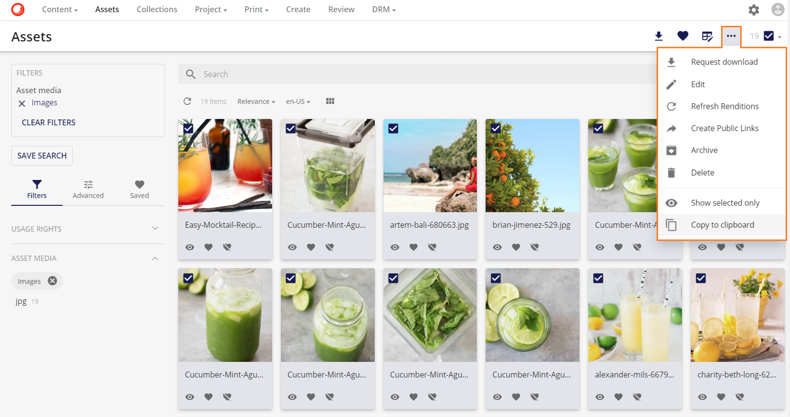

ダウンロードを選択すると、ダウンロードの順番が作成されます。ユーザーは自動的にダウンロードオプションページにリダイレクトされます。詳細については、ダウンロードオプションページの章を参照してください。

## 全文検索とオートコンプリート

全文検索では、アセット名やファイルの内容などのキーワードで検索を行うことができます。フルテキスト検索で有効なフィールドは、プロジェクトごとに設定できます。

> [!Note]
> ファイル内容検索は、Illustratorファイル(.AI)、Portable Document Format (PDF)、PowerPoint (PPT)、Word文書、またはRich Text Format文書の場合にのみサポートされます。

オートコンプリート機能では、検索名の一部だけが入力されるとすぐに検索候補が表示されます。

フルテキスト ボックスに 3 文字が入力されると、オートコンプリート機能では、一致する可能性のある検索候補のリストが表示されます (UI に表示される一致数は設定可能です)。

**オートコンプリート機能**

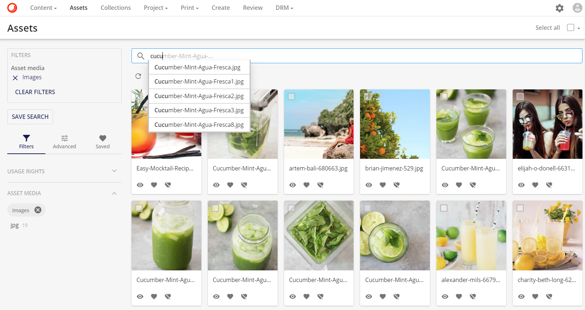

## その他の検索オプション(検索結果)

照会された検索で利用可能な検索オプションは、事前に定義されており、実施形態によって指定される。

典型的には、検索オプションで利用可能な値は、アセットプロパティの選択の一部である。対応する演算子は、選択された検索トピックに依存します。

**検索 > その他の検索オプション**

可能な演算子は次のとおりです

* 数値フィールドまたは文字列フィールドの場合。

    * イコール
    * 開始
    * 終了
    * 含む

* 日付/時刻の値の場合。

    * 等しい
    * 等しくない
    * 大きい
    * 未満
    * 間

日付/時刻の値については、日付の値を選択できるカレンダーが表示されます。

**カレンダーのポップアップ**

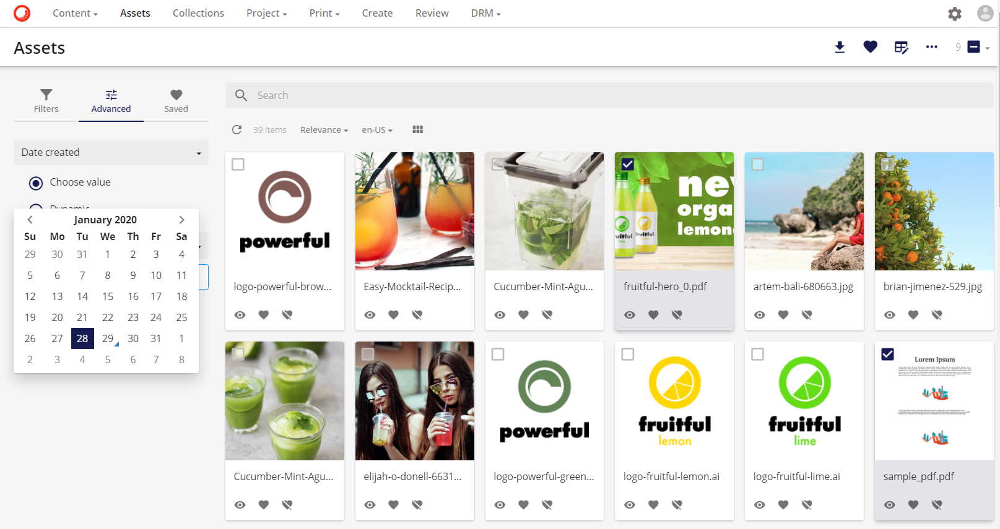

**関連性による検索結果のブースト**

検索コマンドを入力した後に表示される結果の順序は、他のプロパティ（タイトル、説明など）よりもいくつかのプロパティに重要度を追加することで影響を与えることができます。これは、定義管理の管理者が行います。

# ## <a name="saved-selections" />保存されたセレクション

この機能により、ユーザーはアセットの選択項目を作成、整理し、システム内のユーザーと共有することができます。また、保存された選択範囲は、共同作業の性格を持っています。ユーザーは、保存された選択範囲を共有する際に、他のユーザーに閲覧権または編集権を付与することができます。

保存された選択範囲は、検索フィルタとして見ることができます。しかし、保存された選択範囲は、エンティティの静的なリストを返します。保存された検索と比較すると、保存された検索は動的なものです。

> [!Note]
> 保存された選択範囲内のアセットには、ユーザー間で選択範囲が共有されている場合でも、セキュリティポリシーと権限が適用されます。

**新しい保存された選択** 範囲は、2つの方法で起動することができます。

1. 左サイドバーの「新規保存された選択範囲」ボタンをクリックする。

    

2. アセットを選択して、保存された選択範囲に追加ボタンで新規または既存の保存された選択範囲に追加することで、保存された選択範囲に追加することができます。

    

## <a name="new-selection">新しいセレクション

新規セレクションモーダルウィンドウでは、選択範囲の名前と、その選択範囲を共有するユーザーとユーザーグループのリストを指定して新規選択範囲を作成することができます。

保存された選択範囲にどのアセットが追加されるかわからない場合などに、新たに保存された選択範囲ボタンを使用することができます。このように、ユーザーは、選択メニューの操作で「保存された選択範囲に追加」を選択し、選択バスケットにアセットを追加することができます。

さらに、作成者は、保存された選択範囲に共同利用者を追加することができます。デフォルトの閲覧権限を付与すると、割り当てられたユーザーには閲覧権限のみが与えられます。一方、編集権は、保存された選択範囲に項目を追加したり削除したりすることができます。

ユーザーは、「ユーザーの追加」ポップアップで、保存された選択範囲の共有を設定することができます。共有は割り当てられたユーザーまたはユーザーグループで行うことができ、削除は保存された選択範囲の作成者のみが行うことができます。

## 保存したセレクションに追加

**保存された選択範囲に追加** 操作では、選択したアセットを 1 つまたは複数の既存の保存された選択範囲に追加したり、新規に保存された選択範囲に追加したりすることができます。この操作は、選択メニューで利用できます。

この操作をクリックすると、保存された選択範囲に追加するモードウィンドウが開きます。ユーザーは、既存の保存済み選択範囲を1つまたは複数選択してアセットを追加することも、新規選択範囲をクリックして[新規セレクション](#new-selection)を作成することもできます。

## ファセット検索

ファセット検索は、検索ページで検索フィルタを適用するために、関連するタクソノミーを使用します。検索ページで表示されるファセットツリーは、リレーションとエンティティ定義に基づいており、ページの検索コンポーネントで設定することができます。

**検索** > **ファセット**

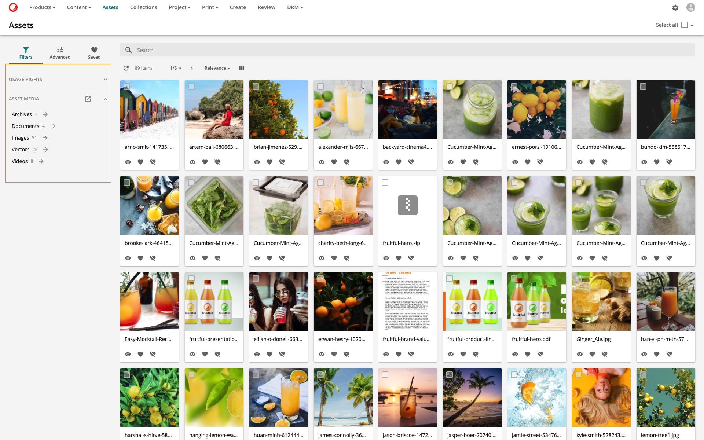

> [!Note]
> 検索コンポーネントでのファセットの設定の詳細については、ファセットの設定を参照してください。

ファセット値をクリックすると、検索フィルタが直接更新され、その特定のファセット値を持つエンティティのみが表示されます。ユーザーは、検索フィルタをクリアすることで、切子検索をクリアすることができます。横長切子の場合は、全文検索バーの下にある横長切子の値を直接削除することで、検索フィルタをクリアすることもできます。

**検索** > **フィルタ**

> [!Note]
> ユーザーは、複数の値を一度に選択できるように、垂直ファセットを構成することができます。選択されたすべての値が検索フィルタに適用されます。

ユーザーは、任意のファセット値の横にある矢印をクリックすることで、ファセットツリーをドリルダウンすることができ、モーダルウィンドウが開き、フルテキスト検索機能と、選択したファセットのすべての値（例：アセットメディア）の階層的なブラウジングを提供します。

ユーザーは、モーダルウィンドウ内の矢印をクリックすることで、階層化されたファセット値をさらにドリルダウンすることができます（例：オーディオ）。

可能な値のリストが長いファセットについては、**もっと見る** ボタンをクリックすることで、すべての値を参照することができます。

## 保存された検索

フルテキスト検索、クエリー検索、ファセット検索で定義されたフィルタ基準は、保存された検索として保存することができます。

定義されたフィルターの下の **検索を保存** ボタンをクリックすると、現在の検索条件が保存されます。

**フィルタ** > **検索を保存**

保存された条件を保存するタイトルを入力し、保存を押します。

**検索** > **保存された検索**

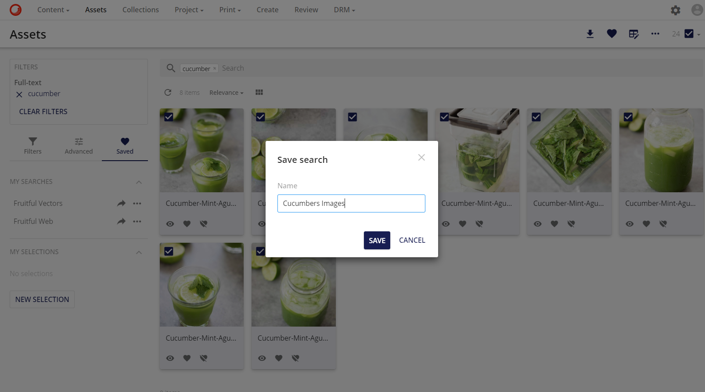

検索エントリは、保存された検索のドロップダウンボックスの下に保存されます。保存された各検索の横には、URLを表示するボタンがあります。 をクリックすると、他のユーザーに渡すことができるURLが生成されます。

セキュリティプロファイルに応じて、検索結果を見ることができます。

**その他のアクション**ボタンには、さらに多くのオプションがあります。

* **更新**: 検索結果を更新することで、保存した検索を更新します。
* **通知を有効にする**: 有効にすると、保存された検索結果が変更されるたびに通知が届きます。
* **通知をオフにする**: 有効にすると、保存された検索結果が変更されたときに通知を受け取らなくなります。
* **編集**: 保存された検索結果のプロパティを編集します。
* **公開**: 保存されている非公開検索を公開します。
* **非公開**: 保存された検索結果を非公開にします。
* **私のデフォルトに設定**: 保存された検索をデフォルトの検索として設定します。
* **私のデフォルトとして削除**: 有効にすると、保存された検索はデフォルトの検索ではなくなります。
* **共有：保存された検索を共有**: 検索への直接リンクを提供することで、保存された検索を共有します。
* **削除：保存された検索を削除**: 保存された検索を削除します。

> [!Note]
> デフォルトの保存された検索とその操作の詳細については、デフォルトの保存された検索を参照してください。

## 保存された検索を購読する
"私の保存した検索" ページから、保存した検索を購読することができます。この機能を使用すると、保存された検索結果に変更があった場合に、ユーザーのメールアドレスに通知メールが送信されます。

この変更は、返された検索結果の数の更新や、メタデータフィールドの変更や新しいファイルのアップロードなど、保存された検索の範囲内のアセット内での変更である可能性があります。詳細については、「私の保存された検索」ページを参照してください。

## 通知を有効にする
ユーザーは通知を有効にすることができます。他のユーザーが保存した検索結果が変更されるたびに、著者のメールアドレスに通知メールが送信されます。

## ビュー
検索ページ（アセットなど）の検索結果は、複数の方法で表示することができます。

* **グリッド**: これは、サムネイルと、選択したテンプレートに基づいて表示される1つ以上のフィールドを持つ検索結果を表示するデフォルトのビューです。この出力モードにはいくつかのバリエーションがあります。

  * 標準: 

    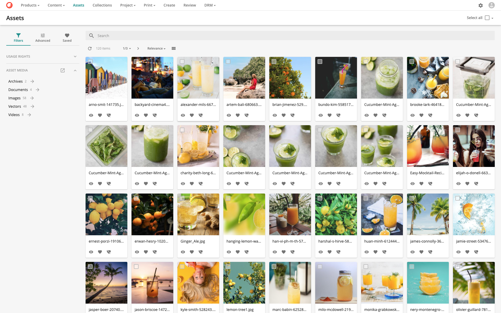

  * 画像左データ右

    

  * 画像右データ左

    

  * 画像の上にグリッドコンテンツを表示

    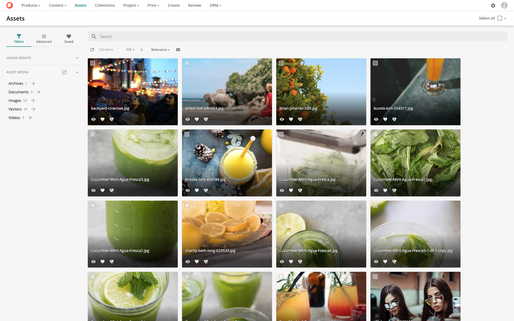

  * グリッド画像のトップワイド

    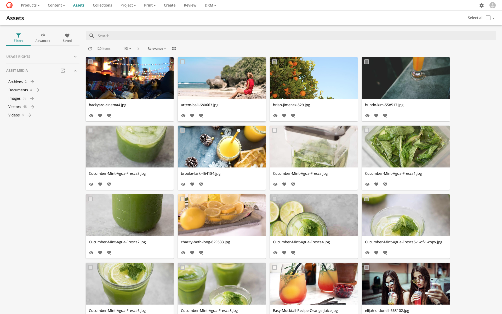

  * グリッドデータのトップボトム。

    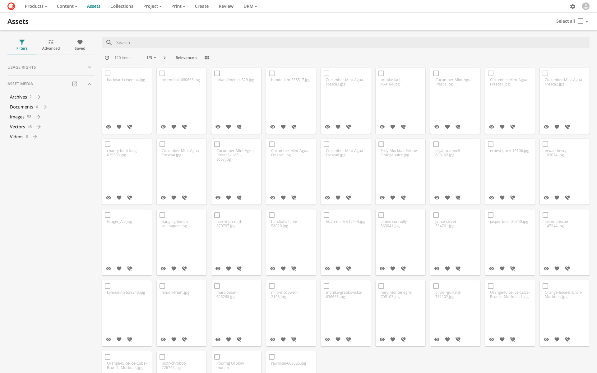

  * コンテンツ

    

  * コンパクト

    

* **インライン プレビュー** 以前はフライアウトビューとして知られていたこの出力モードは、ユーザーが検索ページを離れることなく、または検索の進行状況を失うことなくエンティティの詳細を表示することができる補完的なオプションとして提供されています。この出力モードにはいくつかのバリエーションがあります。

  * デフォルト

    

  * コンテンツ

    

  * ドローワー

    

  * ドローワー（コンテンツ）

    

* **テーブル** もう一つのオプションは、テーブルビューでフィールドを表示することです。このビューは複数のプロパティを異なる列に表示し、2つのバリエーションがあります。

  * デフォルト

    

  * テーブル（画像なし）

    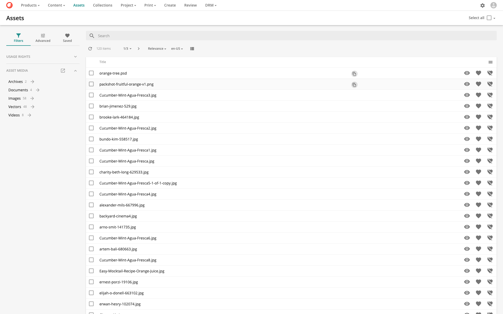
    
* **リスト** リストビューでは、同じ行の各エンティティに対して複数のプロパティを提供します。すべてのエンティティは、それ自身の特定の行を持っています。この出力モードには2つのバリエーションがあります。

  * デフォルト

    

  * カード

    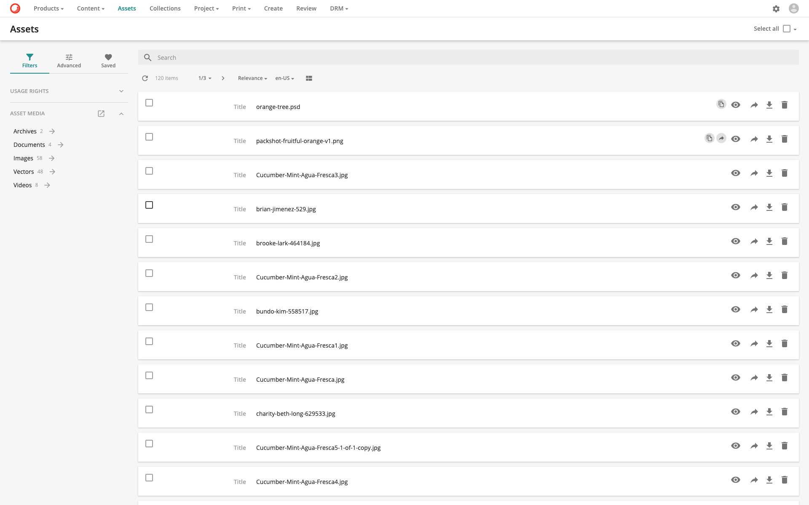

* **カレンダー** このビューは、開始と終了のデータを持つエンティティ（プロジェクトなど）のためのものです。これにより、異なるタイムラインでコンテンツを表示することができます。この出力モードには2つのバリエーションがあります。

  * デフォルト

    

  * コンテンツ

    

* **ピボットテーブル** このビューでは、検索結果を統計チャートの形で表示することができ、データを要約し、洞察力のある集計（例：平均、カウント、合計）を提供します。

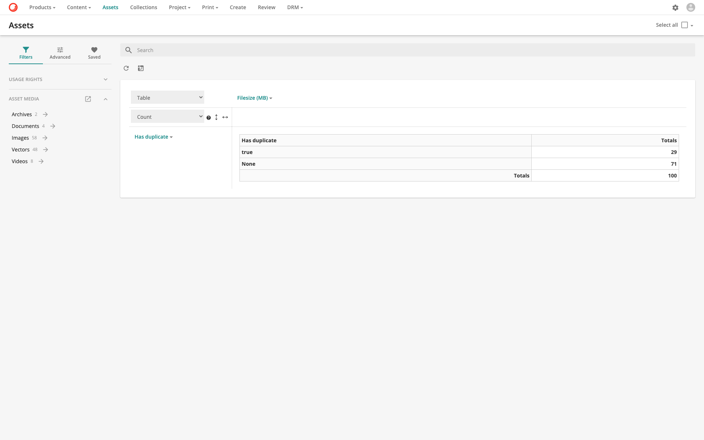

* **チャート** このビューでは、検索結果を様々な集計操作やドリルダウンタイプの多次元チャートとして表示することができます。以下のサンプルチャートは、アセットメディアごとのアセットのカウントを表示しています。

これらのビューは、各検索コンポーネントとその内容に合わせて設定し、調整することができます。出力モードの詳細については、[検索コンポーネントの出力セクション](../../administration/portal/pages/page-components/search-component/output-section.md)を参照してください。