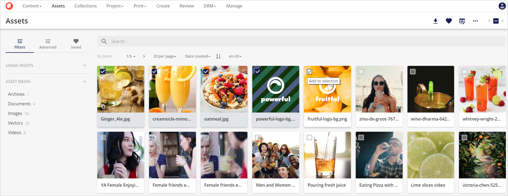

# アセットの選択

コンテンツページでアセットを選択する方法は3つあります。

1. マウスを使ってアセットをクリックして選択する方法。
2. ドラッグ アンド セレクトを使用して、選択するアセットをハイライトします。
3. SHIFT を使用してアセットを選択します。

## マウスを使用する

* アセットの左上にある円の中をクリックします(ツールチップの **選択範囲に追加** に注意)。

  
  
* 必要な数のアセットをクリックします。各アセットには、そのアセットが選択範囲に含まれていることを示すチェックマークが選択範囲内に表示されます。

  

* 選択されたアセットのカウントはツールバーに表示されます。また、このエリアからすべてのアセットを選択することができますのでご注意ください。

  
   

## ドラッグと選択を使用して

* 選択するアセットの上にカーソルを移動します。

  
  

* マウスまたはタッチパッドの左クリックを押したまま、選択範囲を移動して、選択対象のアセットを含むようにします。

  

* クリックを離すと、選択エリア内のアセットが選択範囲に含まれます。

  
  

## SHIFTキーまたはControlキーを使用して、アセットのブロックを選択

* どちらかのキーを押したままにして、左クリックして選択グループに追加する前に、選択するアセットをハイライトします。

  
